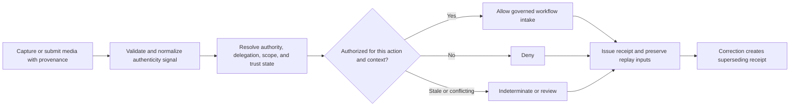

# Disaster Response Damage Assessment

## Purpose and decision boundary

This walkthrough shows how CAWG-derived content-authenticity signals can be combined with TRQP-resolved authority to make a narrow, replayable governance decision.

> **May this image or video be accepted as authenticated field evidence for the identified incident, location, response programme, and decision time?**

The result can authenticate provenance and scoped collection authority; it does not establish the severity of damage, entitlement to aid, causation, or the truth of every contextual claim.

## At-a-glance governance flow



The key architectural separation is between **content provenance**, **authority to perform the action**, and the **downstream substantive decision**.

## Actors and authority

| Role | Responsibility | Evidence expected |
|---|---|---|
| Field collector | Captures and submits incident imagery | CAWG/C2PA-derived provenance and assignment context |
| Response authority | Defines authorized collectors, geographic/incident scope, and permitted use | Signed recognition, delegation, and policy state |
| Operations centre | Uses the result for triage or case routing | Decision receipt and reason codes |
| Affected community member | May contest attribution, location, or use | Correction/redress reference |
| Assurance reviewer | Replays the historical decision | Pinned trust state and audit evidence |

## Governance concerns

- **Incident and geographic scope:** MUST be represented explicitly in policy, context, evidence, or review routing.
- **Offline capture followed by delayed synchronization:** MUST be represented explicitly in policy, context, evidence, or review routing.
- **Rapid revocation after device or credential compromise:** MUST be represented explicitly in policy, context, evidence, or review routing.
- **Privacy minimization for affected persons:** MUST be represented explicitly in policy, context, evidence, or review routing.

## End-to-end sequence

1. Validate the content-authenticity input and normalize only the fields needed by the relying workflow.
2. Bind the request to the specific resource, action, purpose, jurisdiction/location, and decision time.
3. Resolve recognition and every material delegation hop rather than treating identity or recognition as authorization.
4. Evaluate revocation and freshness according to the selected verifier profile.
5. Return `allow`, `deny`, `indeterminate`, or `review` with a stable reason code.
6. Issue a minimized decision receipt that pins policy, authority evidence, verifier version, and decision time.
7. Preserve replay inputs. Any material correction or supersession produces a new linked receipt.

## Decision and failure matrix

| Condition | Expected outcome | Governance meaning |
|---|---|---|
| Recognized, valid delegation, in scope | `allow` | Evidence may enter the governed downstream workflow |
| Recognized but wrong action/resource/context | `deny` | Recognition never substitutes for authorization |
| Authority/delegation revoked at decision time | `deny` | Revocation is enforceable |
| Required trust state stale/unavailable | `indeterminate` | Missing evidence is not silently trusted |
| Authoritative sources conflict | `review` | Conflict remains visible to a human/institutional control |
| Material metadata or authority evidence corrected | new decision | Historical evidence remains immutable |

## Runnable evidence package

The companion directory [`examples/disaster-response-damage-assessment/`](../../examples/disaster-response-damage-assessment/README.md) contains the machine-readable scenario contract and expected outcomes. Validate it with:

```bash
python scripts/validate_walkthrough_examples.py
```

## Evidence produced

- scoped decision and stable reason code;
- authority, delegation, and revocation evidence references;
- policy/profile epoch and decision time;
- minimized decision receipt;
- replay inputs and correction lineage; and
- review/redress reference where the result is contested or non-deterministic.

## Agentic AI Variant

Introducing an agent into **Disaster Response Damage Assessment** changes the assurance problem from actor recognition alone to delegated-action assurance. Apply the common [Agentic AI Assurance model](../agentic-ai/index.md) and treat agent identity as necessary but insufficient evidence.

| Agentic control | Walkthrough requirement |
|---|---|
| Agent role | Model the agent explicitly as **producer/capture agent, submitter, verifier, assessor, or dispatch orchestrator**; authority in one role MUST NOT imply authority in another. |
| Principal | Bind the agent to **emergency authority, field organization, property holder, or response programme** and retain the principal reference in the decision evidence. |
| Delegated authority | Verify a mandate for the exact requested operation; authentication or recognition of the agent alone is not authorization. |
| Scope | Enforce **incident, location, collection task, aid programme, assessment class, geography, time window, and decision threshold** as applicable to the transaction. |
| Tool/sub-agent chain | Where the agent invokes tools or downstream agents, retain evidence of material calls and reject unauthorized sub-delegation. |
| Revocation | Evaluate principal and delegation state at the decision time; revoked or expired authority cannot authorize a new action. |
| Failure | Preserve explicit `deny`, `review`, and `indeterminate` outcomes rather than coercing uncertainty into permission. |
| Audit and redress | Retain agent, principal, mandate, policy epoch, provenance/authority evidence, and a correction or challenge route sufficient for replay. |

Evidence-generation authority, damage-assessment authority, and benefit/dispatch authority must remain independently expressible; one agent must not acquire all three simply by participating in the workflow.

### Agentic conformance probes

In addition to the walkthrough's existing tests, exercise an authenticated agent with no mandate, a valid mandate with an out-of-scope action, revoked/expired delegation, prohibited sub-delegation or tool use, stale/conflicting authority state, and a corrected input that requires a superseding receipt.

## Operational assurance contract

An implementation claiming this walkthrough should demonstrate that:

1. scope is evaluated across action, resource, context, and decision time;
2. revocation is applied to the historical decision time being evaluated;
3. stale or conflicting state cannot yield an implicit positive decision;
4. replay over identical pinned inputs yields the same outcome and reason code; and
5. corrections are additive and linked rather than destructive.

## What this walkthrough does not prove

The result can authenticate provenance and scoped collection authority; it does not establish the severity of damage, entitlement to aid, causation, or the truth of every contextual claim. The relying organization remains accountable for the downstream legal, professional, safety, editorial, or policy judgment.
