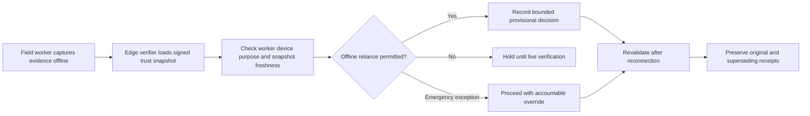
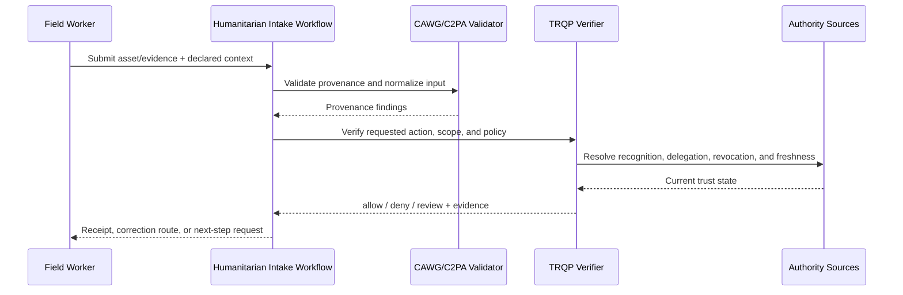
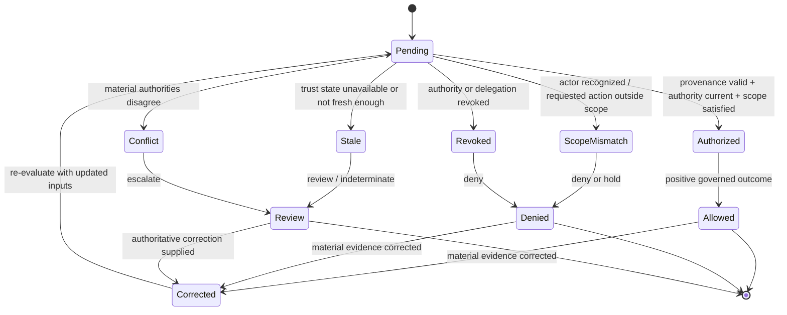

# Humanitarian Offline Field Evidence

## Purpose and decision boundary

A field worker or local partner captures evidence where live registry access is unavailable. Signed snapshots permit bounded degraded operation with explicit staleness and revalidation obligations.

The decision is deliberately narrow:

> **May this asset be used for offline needs assessment under the authority, scope, policy, and trust state recorded at decision time?**

A successful result does not establish factual truth, legal liability, professional judgment, product authenticity, clinical validity, or entitlement beyond that scoped action.

## Plain-language summary

A humanitarian field worker captures or submits evidence in a location with intermittent or no connectivity. The receiving organization needs to know whether the worker or device was authorized for the assessment, whether the evidence is bound to the correct operation and location, and whether the offline trust state is fresh enough under the declared degraded-mode policy.

A positive result means **the evidence may be used for the defined needs-assessment workflow**. It does not prove beneficiary eligibility, establish the underlying humanitarian fact, or authorize aid distribution by itself. The verifier creates a transparent way to use signed snapshots and later reconciliation without pretending that offline uncertainty has disappeared.

## At-a-glance governance flow



Offline operation is bounded degraded assurance, not an assertion that stale trust state is equivalent to live verification.


## Cross-functional interaction view

This swimlane-style interaction view shows how evidence moves between the submitting actor, the relying workflow, provenance validation, governed authority resolution, and the bounded operational decision.



## Governed decision state model

This state model keeps the governance lifecycle explicit so authorization, scope failure, revocation, stale trust state, conflict, and superseding correction are visible rather than collapsed into a single pass/fail result.



## Why this workflow needs verifiable governance

Humanitarian operations expose a hard governance problem: the need to act quickly when live registries and revocation services may be unreachable. Simply failing open can admit withdrawn or mis-scoped authority; simply failing closed can prevent legitimate field work. The governing organization therefore needs an explicit, testable degraded-mode policy.

This walkthrough makes that policy visible. Snapshot provenance, age, authorization scope, later synchronization, and correction can all become part of the evidence. That lets teams distinguish “trusted under a bounded offline policy” from “confirmed against current online state.”

## Roles in the workflow
| Role | Responsibility | Evidence expected |
|---|---|---|
| Submitter | Supplies the asset and declared context | CAWG/C2PA-derived integration signal |
| Governing authority | Defines who may perform `admit_field_evidence` | Signed policy and recognition information |
| Relying service | Applies the decision to its own workflow | Decision receipt and reason codes |
| Affected party | May challenge metadata, authority, or use | Correction, appeal, or redress reference |
| Assurance reviewer | Replays and audits the decision | Pinned inputs and audit bundle |


## System components mapped to workflow concepts

| Workflow concept | Verifier concept | Practical meaning |
|---|---|---|
| Field deployment/operation | Resource and jurisdiction scope | Binds evidence to the intended mission and location |
| Worker/device mandate | Recognition/delegation | Shows who may collect or submit evidence |
| Signed offline snapshot | Pinned trust-state evidence | Supports bounded verification without live registry access |
| Snapshot age/freshness | Freshness policy | Determines when degraded operation must stop or escalate |
| Later reconciliation | Correction/supersession | Re-evaluates decisions when current authority state becomes available |
## Governance concerns

- **Offline Snapshot Freshness:** represented as explicit policy, context, evidence, or review requirements.
- **Source Safety:** represented as explicit policy, context, evidence, or review requirements.
- **Location Minimization:** represented as explicit policy, context, evidence, or review requirements.
- **Reconciliation After Connectivity:** represented as explicit policy, context, evidence, or review requirements.

## End-to-end sequence

1. Validate the content-authenticity input and normalize it into the CAWG-TRQP integration signal.
2. Resolve the actor, `aid-organisation` authority source, and relevant delegation chain.
3. Evaluate `admit_field_evidence` against asset, resource, jurisdiction, purpose, and time scope.
4. Check revocation, freshness, descriptor integrity, and any profile-specific fail-closed requirements.
5. Return `allow`, `deny`, `indeterminate`, or `review` with stable reason codes.
6. Issue a decision receipt that identifies the policy epoch, authority evidence, verifier version, and evidence minimization profile.
7. Preserve replay inputs. A corrected or superseding decision creates a new receipt rather than mutating the historical record.

## Required cases

| Case | Expected outcome | Assurance point |
|---|---|---|
| Authorized and in scope | `allow` | Positive path is reproducible |
| Recognized but scope mismatch | `deny` | Recognition is not authorization |
| Revoked authority | `deny` | Revocation is enforced |
| Stale or unavailable authority state | `indeterminate` or `review` | Missing evidence never silently becomes trusted |
| Conflicting authorities | `review` | Conflict is visible and routed |
| Corrected metadata | new decision | History remains immutable and auditable |

## Runnable evidence package

The companion directory [`examples/humanitarian-offline-field-evidence/`](../../examples/humanitarian-offline-field-evidence/README.md) contains a machine-readable scenario manifest and expected outcomes. Run:

```bash
python scripts/validate_walkthrough_examples.py
```

## What evidence is produced

- scoped decision and stable reason codes;
- authority, delegation, and revocation evidence references;
- policy and context-profile versions;
- minimized decision receipt;
- replay inputs and correction lineage; and
- an explicit review or redress route for contested decisions.

## What this walkthrough does not prove

This walkthrough does not convert provenance into truth and does not transfer institutional accountability to the verifier. The relying organization remains responsible for the lawful, proportionate, and procedurally fair use of the result.

## What can be tested

| Test question | Artifact or command |
|---|---|
| Do the walkthrough diagrams and required reader-facing sections pass quality validation? | `python scripts/validate_walkthrough_quality.py` |
| Do Mermaid flow, interaction, and state diagrams pass structural validation? | `python scripts/validate_walkthrough_diagrams.py` |
| Do machine-readable walkthrough manifests contain the common lifecycle cases? | `python scripts/validate_walkthrough_examples.py` |
| Do shipped example artefacts remain structurally valid? | `python scripts/validate_examples.py` |
| Does the complete repository validation surface pass? | `make validate` |

## Why this improves adoption

This walkthrough is easier to adopt when the governance value is expressed in familiar operational terms:

- field teams get a usable trust model even when connectivity is unreliable;
- program managers can define degraded operation explicitly instead of relying on informal exceptions;
- auditors can distinguish live, cached, and snapshot-based authority evidence;
- later revocation or correction can supersede a field decision without erasing what was known at the time.

## Governance interpretation

Offline operation is a governance choice, not merely a networking condition. The humanitarian organization must decide how old authority evidence may be, which actions may proceed in degraded mode, and which require escalation or later confirmation.

The verifier makes those choices executable and records the basis for them. Humanitarian judgment, beneficiary protection, and aid-allocation authority remain outside the verifier’s bounded decision.

## Agentic AI Variant

Introducing an agent into **Humanitarian Offline Field Evidence** changes the assurance problem from actor recognition alone to delegated-action assurance. Apply the common [Agentic AI Assurance model](../agentic-ai/index.md) and treat agent identity as necessary but insufficient evidence.

| Agentic control | Walkthrough requirement |
|---|---|
| Agent role | Model the agent explicitly as **field capture agent, delegated submitter, offline verifier, or synchronization orchestrator**; authority in one role MUST NOT imply authority in another. |
| Principal | Bind the agent to **humanitarian organization, field team, beneficiary, partner, or programme authority** and retain the principal reference in the decision evidence. |
| Delegated authority | Verify a mandate for the exact requested operation; authentication or recognition of the agent alone is not authorization. |
| Scope | Enforce **programme, geography, beneficiary/case, evidence class, offline validity window, synchronization policy, and action limits** as applicable to the transaction. |
| Tool/sub-agent chain | Where the agent invokes tools or downstream agents, retain evidence of material calls and reject unauthorized sub-delegation. |
| Revocation | Evaluate principal and delegation state at the decision time; revoked or expired authority cannot authorize a new action. |
| Failure | Preserve explicit `deny`, `review`, and `indeterminate` outcomes rather than coercing uncertainty into permission. |
| Audit and redress | Retain agent, principal, mandate, policy epoch, provenance/authority evidence, and a correction or challenge route sufficient for replay. |

Offline authority must be explicitly time-bounded and reconciled when connectivity returns; stale state cannot silently become permission, particularly for eligibility or resource-allocation decisions.

### Agentic conformance probes

In addition to the walkthrough's existing tests, exercise an authenticated agent with no mandate, a valid mandate with an out-of-scope action, revoked/expired delegation, prohibited sub-delegation or tool use, stale/conflicting authority state, and a corrected input that requires a superseding receipt.

## Operational assurance contract

This walkthrough is testable as a bounded governance decision rather than as a claim that the underlying content is true.

| Control point | Required behavior | Evidence |
|---|---|---|
| Decision | Evaluate **Field-evidence acceptance** only | Stable outcome and reason code |
| Authority | Resolve programme or delegated field authority, delegation, scope, and current status | Authority and delegation references |
| Freshness | Apply the required revocation and trust-state freshness rules | Timestamped trust-state evidence |
| Policy | Pin the programme policy epoch used for evaluation | Policy identifier/version or digest |
| Failure | Fail visibly on stale, unavailable, ambiguous, or conflicting authority state | `indeterminate`/`review` receipt rather than implicit trust |
| Correction | Preserve the original decision and issue a superseding receipt when material inputs change | Immutable receipt lineage |
| Handoff | Pass the result into **humanitarian case workflow** without transferring accountability to the verifier | Relying-party disposition/audit reference |

### Conformance assertions

An implementation claiming this walkthrough should be able to demonstrate that:

1. recognition alone never grants the requested action when scope or delegation is absent;
2. a revoked authority or delegation cannot produce a positive decision for the affected decision time;
3. stale or conflicting trust state is surfaced explicitly and never silently coerced to `allow`;
4. identical pinned inputs replay to the same governed outcome and reason code; and
5. a correction produces a new decision linked to, rather than overwriting, the historical receipt.

