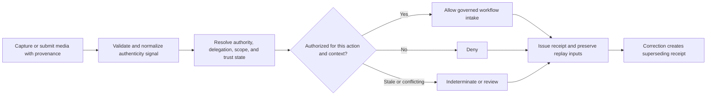
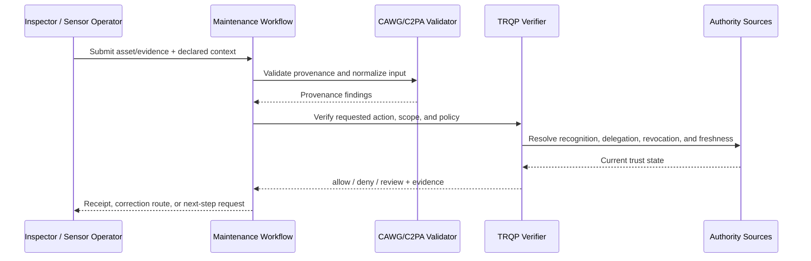
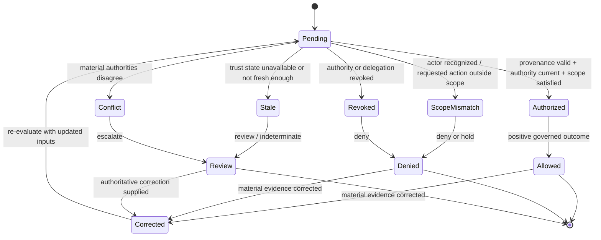

# Industrial Inspection and Maintenance Evidence

## Purpose and decision boundary

This walkthrough shows how CAWG-derived content-authenticity signals can be combined with TRQP-resolved authority to make a narrow, replayable governance decision.

> **May this inspection media be accepted for the identified asset, maintenance task, location, and inspection window under the current delegated authority?**

The verifier can establish governed evidence acceptance; it cannot determine equipment safety, regulatory compliance, defect severity, or engineering fitness for service.

## At-a-glance governance flow



The key architectural separation is between **content provenance**, **authority to perform the action**, and the **downstream substantive decision**.


## Cross-functional interaction view

This swimlane-style interaction view shows how evidence moves between the submitting actor, the relying workflow, provenance validation, governed authority resolution, and the bounded operational decision.



## Governed decision state model

This state model keeps the governance lifecycle explicit so authorization, scope failure, revocation, stale trust state, conflict, and superseding correction are visible rather than collapsed into a single pass/fail result.



## Actors and authority

| Role | Responsibility | Evidence expected |
|---|---|---|
| Inspector or technician | Captures media during inspection/maintenance | Provenance and work-order context |
| Asset operator | Delegates inspection authority and scope | Signed delegation and policy state |
| Maintenance system | Uses the result for workflow progression | Decision receipt and reason codes |
| Safety/compliance reviewer | Reviews exceptions or contested evidence | Review and escalation reference |
| Auditor | Replays the historical decision | Pinned policy, authority, and asset context |

## Governance concerns

- **Asset and work-order scope:** MUST be represented explicitly in policy, context, evidence, or review routing.
- **Subcontractor delegation chains:** MUST be represented explicitly in policy, context, evidence, or review routing.
- **Credential/device compromise:** MUST be represented explicitly in policy, context, evidence, or review routing.
- **Separation of evidence acceptance from engineering sign-off:** MUST be represented explicitly in policy, context, evidence, or review routing.

## End-to-end sequence

1. Validate the content-authenticity input and normalize only the fields needed by the relying workflow.
2. Bind the request to the specific resource, action, purpose, jurisdiction/location, and decision time.
3. Resolve recognition and every material delegation hop rather than treating identity or recognition as authorization.
4. Evaluate revocation and freshness according to the selected verifier profile.
5. Return `allow`, `deny`, `indeterminate`, or `review` with a stable reason code.
6. Issue a minimized decision receipt that pins policy, authority evidence, verifier version, and decision time.
7. Preserve replay inputs. Any material correction or supersession produces a new linked receipt.

## Decision and failure matrix

| Condition | Expected outcome | Governance meaning |
|---|---|---|
| Recognized, valid delegation, in scope | `allow` | Evidence may enter the governed downstream workflow |
| Recognized but wrong action/resource/context | `deny` | Recognition never substitutes for authorization |
| Authority/delegation revoked at decision time | `deny` | Revocation is enforceable |
| Required trust state stale/unavailable | `indeterminate` | Missing evidence is not silently trusted |
| Authoritative sources conflict | `review` | Conflict remains visible to a human/institutional control |
| Material metadata or authority evidence corrected | new decision | Historical evidence remains immutable |

## Runnable evidence package

The companion directory [`examples/industrial-inspection-maintenance/`](../../examples/industrial-inspection-maintenance/README.md) contains the machine-readable scenario contract and expected outcomes. Validate it with:

```bash
python scripts/validate_walkthrough_examples.py
```

## Evidence produced

- scoped decision and stable reason code;
- authority, delegation, and revocation evidence references;
- policy/profile epoch and decision time;
- minimized decision receipt;
- replay inputs and correction lineage; and
- review/redress reference where the result is contested or non-deterministic.

## Agentic AI Variant

Introducing an agent into **Industrial Inspection and Maintenance Evidence** changes the assurance problem from actor recognition alone to delegated-action assurance. Apply the common [Agentic AI Assurance model](../agentic-ai/index.md) and treat agent identity as necessary but insufficient evidence.

| Agentic control | Walkthrough requirement |
|---|---|
| Agent role | Model the agent explicitly as **capture/producer agent, submitter, verifier, maintenance orchestrator, or recommendation agent**; authority in one role MUST NOT imply authority in another. |
| Principal | Bind the agent to **asset owner, operator, accredited inspector, contractor, or safety authority** and retain the principal reference in the decision evidence. |
| Delegated authority | Verify a mandate for the exact requested operation; authentication or recognition of the agent alone is not authorization. |
| Scope | Enforce **asset/work order, inspection class, site, time window, delegated subcontracting, and engineering decision threshold** as applicable to the transaction. |
| Tool/sub-agent chain | Where the agent invokes tools or downstream agents, retain evidence of material calls and reject unauthorized sub-delegation. |
| Revocation | Evaluate principal and delegation state at the decision time; revoked or expired authority cannot authorize a new action. |
| Failure | Preserve explicit `deny`, `review`, and `indeterminate` outcomes rather than coercing uncertainty into permission. |
| Audit and redress | Retain agent, principal, mandate, policy epoch, provenance/authority evidence, and a correction or challenge route sufficient for replay. |

Authenticated inspection evidence must remain separate from engineering certification or safety-to-operate authority unless the agent has a distinct mandate for that downstream decision.

### Agentic conformance probes

In addition to the walkthrough's existing tests, exercise an authenticated agent with no mandate, a valid mandate with an out-of-scope action, revoked/expired delegation, prohibited sub-delegation or tool use, stale/conflicting authority state, and a corrected input that requires a superseding receipt.

## Operational assurance contract

An implementation claiming this walkthrough should demonstrate that:

1. scope is evaluated across action, resource, context, and decision time;
2. revocation is applied to the historical decision time being evaluated;
3. stale or conflicting state cannot yield an implicit positive decision;
4. replay over identical pinned inputs yields the same outcome and reason code; and
5. corrections are additive and linked rather than destructive.

## What this walkthrough does not prove

The verifier can establish governed evidence acceptance; it cannot determine equipment safety, regulatory compliance, defect severity, or engineering fitness for service. The relying organization remains accountable for the downstream legal, professional, safety, editorial, or policy judgment.
