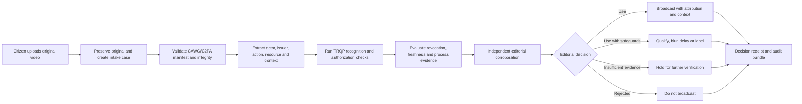
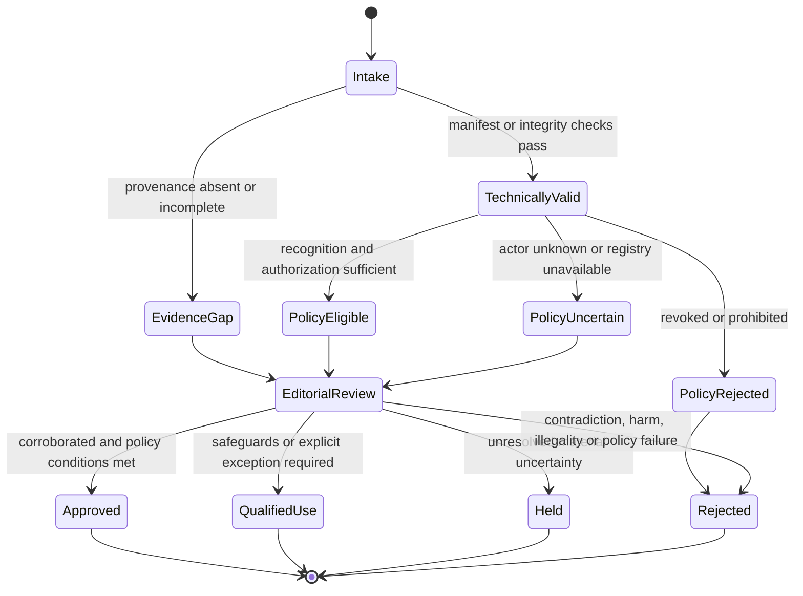

# Newsroom Citizen-Video Verification

A news channel receives a video uploaded by a citizen and is considering showing it during a live or recorded news segment. This is a distinct workflow from a contracted inspection, contest submission, or publisher-originated asset. The newsroom does not control the capture environment, the contributor may be unknown, time pressure is high, and the consequences of a false or misleading broadcast can be significant.

This scenario therefore merits its own walkthrough. It demonstrates how CAWG/C2PA provenance and TRQP-based trust decisions can support editorial verification without pretending that technical provenance establishes the truth of what the video depicts.

## The decision the newsroom must make

The operational question is not simply:

> Is the file signed?

The newsroom must decide:

> Is there enough reliable evidence about the asset, contributor, handling process, and applicable authority to use this video in this broadcast, with what qualification and under whose editorial responsibility?

A CAWG/C2PA validation result can establish integrity, provenance, and the assertions bound to the asset. TRQP can establish whether an actor, issuer, fact-checking service, capture program, or newsroom intake authority is recognized or authorized under a declared policy. Neither mechanism independently proves that the depicted event happened exactly as claimed.

{: .important }
> **Editorial truth remains an accountable human and institutional decision.** The verifier contributes evidence and policy outcomes. It does not replace source corroboration, geolocation, chronology checks, contextual review, legal review, or editorial judgment.

## Roles and authority boundaries

| Role | Authority and responsibility |
|---|---|
| Citizen contributor | Supplies the video, claimed capture context, consent or licence information, and any available provenance assertions |
| Intake producer | Opens the case, records the intended broadcast use, and ensures the original asset is preserved |
| CAWG/C2PA validator | Validates the manifest, signatures, assertion bindings, edits, and provenance chain |
| TRQP verifier | Evaluates recognition, authorization, revocation, freshness, and process-policy conditions |
| Trust registry or gateway | Answers policy questions for the declared authority and scope |
| Verification desk | Performs corroboration such as geolocation, chronology, source contact, reverse search, and event matching |
| Editor | Owns the final decision to broadcast, qualify, delay, blur, or reject the video |
| Auditor or standards reviewer | Replays the machine-verifiable decision and inspects the evidence trail |

The editor cannot delegate editorial accountability to the registry or verifier. Conversely, the verifier must not silently invent authority or policy that the newsroom has not declared.

## End-to-end newsroom flow



The flow intentionally places editorial corroboration after technical and policy evaluation. A technically valid asset may still be misleading, miscaptioned, old, staged, unlawfully obtained, or unsafe to broadcast.

## Step 1: Preserve the original and record the purpose

The newsroom should preserve the original upload before transcoding, clipping, adding graphics, or sending it through messaging platforms. The intake record should capture:

- an immutable asset identifier and digest;
- receipt time and channel;
- contributor identifier or pseudonymous case identifier;
- claimed location and time;
- claimed event;
- intended action, such as `broadcast`, `quote`, or `archive`;
- intended resource or programme segment;
- consent, licence, and contact status;
- urgency and risk tier; and
- the newsroom authority under which the decision will be made.

The intended action and resource matter because authorization is scoped. Permission to submit a video is not automatically permission for the newsroom to broadcast an identifiable person, disclose a sensitive location, or reuse the footage indefinitely.

## Step 2: Validate provenance and integrity

The CAWG/C2PA validator should determine:

- whether a manifest exists;
- whether signatures validate;
- whether assertions remain bound to the received asset;
- what device, application, or service issued the assertions;
- whether edits or transformations are declared;
- whether the provenance chain is complete or partially missing; and
- whether validation produced warnings or unsupported assertion types.

Absence of a manifest should not automatically mean the video is false. It should produce a defined evidence gap and move the case into a more cautious policy branch.

## Step 3: Normalize the CAWG output for TRQP

The integration adapter should produce the portable CAWG-to-TRQP signal described in the [CAWG Input Contract](../cawg-input-contract.md) and [Integration Enablement Guide](../cawg-trqp-integration-enablement.md).

A representative newsroom signal may contain:

```json
{
  "type": "CawgTrqpIntegrationSignal",
  "version": "0.1",
  "asset": {
    "id": "urn:sha256:example-video-digest",
    "media_type": "video/mp4"
  },
  "validation": {
    "status": "verified_with_warnings",
    "validated_at": "2026-07-21T09:15:00Z",
    "evidence_ref": "urn:newsroom:evidence:c2pa:case-1842"
  },
  "actor": {
    "id": "urn:newsroom:source:case-1842",
    "identifier_type": "case_identifier"
  },
  "issuer": {
    "id": "did:web:capture-app.example",
    "identifier_type": "did"
  },
  "action": {
    "type": "broadcast",
    "resource": "news-segment:evening-bulletin"
  },
  "context": {
    "jurisdiction": "IN",
    "risk_tier": "high",
    "content_origin": "citizen_upload",
    "breaking_news": true
  }
}
```

The example is non-normative. A real deployment must use vocabularies and identifier types agreed by the relevant CAWG/TRQP integration profile and newsroom governance policy.

## Step 4: Execute recognition and authorization checks

The verifier may use the composite `POST /trqp/verify` operation or explicitly call recognition and authorization operations documented in the [API Call Catalogue](../api-call-catalogue.md).

Typical questions include:

- Is the issuer of the capture or identity assertion recognized for this purpose?
- Is the contributor enrolled in a recognized eyewitness, freelancer, emergency-response, or trusted-source programme?
- Is the newsroom intake service authorized to rely on the specified registry?
- Is the proposed `broadcast` action permitted for this resource and context?
- Has the contributor, credential, device, issuer, or policy authority been revoked?
- Is the policy evidence fresh enough for the risk and urgency of the segment?

For an ordinary citizen, the actor may not be pre-authorized or registered. That must not be converted into a false assertion that the video is untrustworthy. The outcome should distinguish **unknown or unrecognized actor** from **revoked, prohibited, or fraudulent actor**.

## Step 5: Apply a newsroom-specific decision policy

A newsroom profile should combine technical evidence, TRQP outcomes, and editorial risk controls.

| Condition | Illustrative policy response |
|---|---|
| Valid provenance, recognized issuer, corroborated event | Eligible for editorial approval |
| Valid provenance, unknown citizen, independently corroborated event | Eligible with source qualification and editor approval |
| No provenance, but strong independent corroboration | Hold or use only under an explicit exception with recorded rationale |
| Valid provenance but event claim is contradicted | Reject or use only to report the misinformation itself |
| Revoked issuer, tampered binding, or conflicting provenance | Quarantine and escalate |
| Identifiable vulnerable person or sensitive location | Apply privacy, safety, and legal review regardless of technical result |
| Registry unavailable during breaking news | Use bounded cache or return indeterminate according to declared freshness policy; do not silently treat outage as authorization |

The policy should define who may approve exceptions, how long an exception remains valid, and what evidence must be retained.

## Step 6: Perform independent editorial corroboration

TRQP and CAWG/C2PA do not replace newsroom verification. The verification desk should consider, as applicable:

- contacting the contributor;
- checking the original file and metadata;
- geolocating landmarks, terrain, signs, weather, and shadows;
- validating chronology against known events;
- comparing other independent footage or reporting;
- checking for prior publication or recycled footage;
- identifying edits, missing context, or misleading captions;
- assessing consent, privacy, safety, and legal exposure; and
- recording unresolved contradictions.

These checks may be represented as process evidence, but the source material and sensitive personal data should be minimized and protected.

## Step 7: Produce a composite decision



A composite result should avoid reducing the case to a single unexplained boolean. At minimum it should preserve:

- CAWG/C2PA validation result;
- recognition and authorization outcomes;
- policy and revocation freshness;
- corroboration status;
- editorial disposition;
- exception authority, where used;
- reason codes;
- timestamps and policy epoch; and
- references to the evidence retained.

## Step 8: Retain a decision receipt and audit bundle

The decision receipt should be suitable for the producer and editor. The audit bundle should support later investigation, correction, complaint handling, standards review, or legal disclosure.

| Evidence | Purpose |
|---|---|
| Original asset digest | Proves which upload was evaluated |
| Manifest-validation evidence | Records provenance and integrity findings |
| Normalized integration signal | Shows what CAWG-derived inputs entered TRQP evaluation |
| Recognition and authorization responses | Records the current governance decision |
| Freshness and revocation evidence | Shows how current the trust decision was |
| Editorial corroboration status | Prevents technical provenance from being mistaken for factual verification |
| Final disposition and approver | Preserves accountable human authority |
| Replay inputs and version pins | Allows deterministic re-evaluation of the machine-verifiable portion |

Sensitive source identity, contact details, location data, and unpublished footage should not be copied indiscriminately into portable audit bundles. Use protected references or redacted evidence packages where disclosure is not authorized.

## Scale and cache considerations

A newsroom may receive a very large volume of uploads during an election, conflict, disaster, or major public event. Object-ingestion rate does not need to equal live trust-registry lookup rate. Decisions that share an authority, issuer, action, resource class, context, and policy epoch may use governed cache entries, provided freshness and revocation requirements are satisfied.

Use the [Scalability and Performance](../scalability-and-performance.md), [Cache, Freshness, and Revocation](../cache-freshness-and-revocation.md), and [High-Volume Deployment Profile](../high-volume-deployment-profile.md) guidance to define:

- maximum acceptable decision age;
- live-on-risk conditions;
- revocation urgency;
- registry-outage behavior;
- cache provenance in receipts;
- request coalescing and overload handling; and
- whether breaking-news exceptions fail closed, return indeterminate, or require named editorial approval.

## Failure and abuse cases to test

| Test case | Expected evidence or behavior |
|---|---|
| Valid manifest attached to an unrelated video | Binding validation fails |
| Old video presented as a current event | Provenance may validate, but chronology corroboration fails |
| Recognized capture application, unknown citizen | Issuer may be recognized while actor authorization remains unknown |
| Revoked contributor credential | Authorization fails with revocation evidence |
| Registry outage | Bounded cache or indeterminate outcome according to policy |
| Conflicting location assertions | Case escalates with conflict recorded |
| Edited video with disclosed transformation | Policy decides whether the declared edit is acceptable |
| Undisclosed edit or damaged provenance chain | Integrity warning or rejection according to profile |
| Sensitive victim or minor visible | Privacy and safety review blocks automatic broadcast approval |
| Live-stream clip with no original file | Evidence gap is explicit; exception requires named authority and rationale |

## What this walkthrough establishes

This use case justifies a dedicated walkthrough because it combines four decision planes that must remain distinct:

1. **Content authenticity:** whether provenance and integrity assertions validate.
2. **Trust governance:** whether actors, issuers, authorities, actions, and resources are recognized or authorized.
3. **Editorial verification:** whether the depicted event and supplied context are sufficiently corroborated.
4. **Publication accountability:** whether the newsroom may lawfully and responsibly broadcast the material.

The reference implementation directly demonstrates the first two and produces evidence that can be incorporated into the third and fourth. A production newsroom integration would require a newsroom-specific policy profile, controlled editorial process evidence, privacy protections, and operational integrations with the content-management and broadcast systems.

## Related documentation

- [Video Verification Walkthrough](../video-verification-walkthrough.md)
- [CAWG-to-TRQP Integration Enablement](../cawg-trqp-integration-enablement.md)
- [CAWG Input Contract](../cawg-input-contract.md)
- [API Call Catalogue](../api-call-catalogue.md)
- [Verifier Profiles](../verifier-profiles.md)
- [Decision Receipt Specification](../decision-receipt-specification.md)
- [Audit Bundle Profile](../audit-bundle-profile.md)
