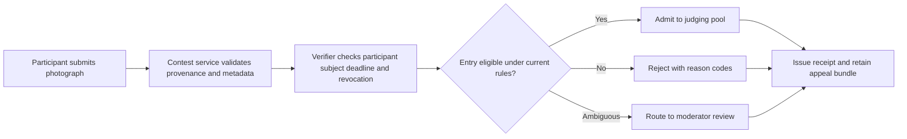
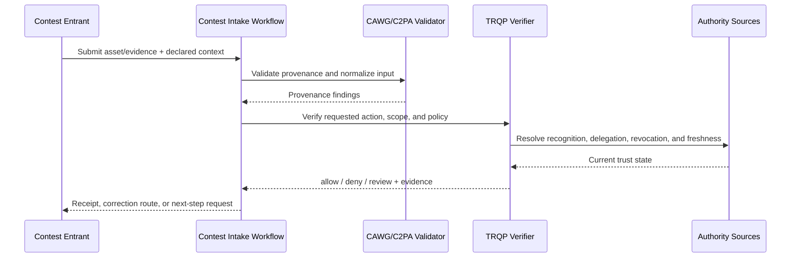
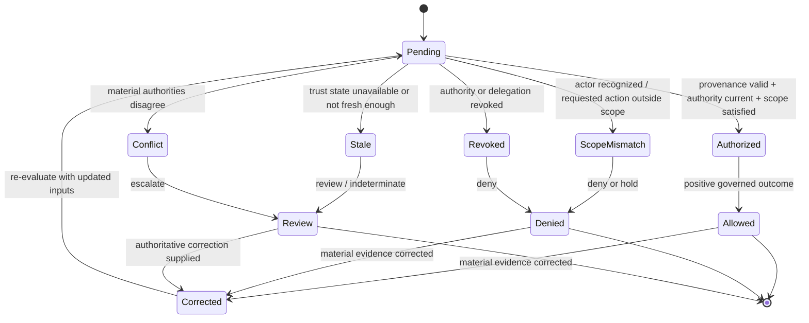

# Photography Contest Verification Walkthrough

## Purpose

This walkthrough explains how the CAWG–TRQP verifier reference implementation can be used for a public, user-submitted photography contest similar in shape to a large heritage-photo campaign. It is written for organisers, judges, contributors, technologists, governance teams, and institutional partners who need to understand what the system does without first becoming specialists in digital credentials, content provenance, or trust registries.

The core idea is simple: a photography contest is not only a gallery of images. It is a decision system. It accepts some entries, rejects others, escalates some for review, and eventually produces winners. Every one of those decisions depends on rules, authorities, evidence, and timing. The verifier makes those dependencies explicit, testable, and replayable.

In a conventional contest workflow, many important judgments are buried in platform logic, spreadsheet checks, informal moderator review, or manual communication between organisers. That may work at small scale. It becomes fragile when a contest receives thousands of submissions, crosses jurisdictions, uses multiple upload tools, or depends on volunteers who need consistent and transparent rules. The verifier turns that workflow into an evidence-producing governance process.

## Plain-language summary

A participant submits a photograph. The system checks whether the photograph appears eligible under the published contest rules. It checks whether the contributor is allowed to submit, whether the claimed monument is in the approved monument list, whether the submission arrived before the deadline, whether provenance/process evidence is present, and whether the entry or contributor has been revoked or disqualified.

The important part is not merely that the system says **accepted** or **rejected**. The important part is that it can show:

- which rules were used;
- who had authority to publish those rules;
- whether the rule feed was fresh;
- whether the revocation feed was checked;
- what evidence was evaluated;
- why the decision was reached; and
- whether another reviewer can replay the decision later.

This changes the contest posture from “trust the platform” to “verify the decision.”

## At-a-glance governance flow



The flow makes eligibility decisions testable without replacing artistic judging or appeal authority.


## Cross-functional interaction view

This swimlane-style interaction view shows how evidence moves between the submitting actor, the relying workflow, provenance validation, governed authority resolution, and the bounded operational decision.



## Governed decision state model

This state model keeps the governance lifecycle explicit so authorization, scope failure, revocation, stale trust state, conflict, and superseding correction are visible rather than collapsed into a single pass/fail result.



## Why a photography contest needs verifiable governance

A public photography contest has a deceptively complex control surface. The visible workflow is easy to understand: submit, review, judge, award. The hidden workflow is harder: identity, eligibility, authorship, provenance, location, timing, consent, licensing, rule updates, disqualification, appeals, and audit.

Without a verifier, these controls often live as institutional memory. One organiser knows that a rule changed. Another volunteer knows which monument list is current. A judge assumes that submissions have already been screened. A participant may not know why their entry was rejected. If a dispute arises, the contest may have logs, but logs are not the same thing as a replayable decision record.

With this verifier, each contest decision can produce a decision receipt and an audit bundle. The receipt explains the result. The audit bundle preserves the inputs necessary to reproduce the result. This is especially useful when contests rely on open participation, distributed moderation, and public legitimacy.

## Roles in the workflow

| Role | What they do | What the verifier helps prove |
|---|---|---|
| Participant | Submits a photograph and supporting metadata | The entry was evaluated against the same rules as other entries |
| Contest organiser | Publishes contest rules and deadlines | The policy feed was signed by an authorised contest authority |
| Monument/list authority | Publishes the eligible subject list | The claimed subject came from an approved snapshot/feed |
| Moderator | Reviews flagged or rejected entries | The decision has machine-readable reasons and evidence |
| Judge | Evaluates eligible photos | The judging pool only includes entries that passed eligibility checks |
| Appeals reviewer | Reconsiders disputed decisions | The original decision can be replayed using pinned inputs |
| Auditor/sponsor | Reviews contest integrity | The contest can produce evidence instead of narrative assurances |

## System components mapped to contest concepts

| Contest concept | Verifier concept | Practical meaning |
|---|---|---|
| Contest rulebook | Policy feed | Machine-readable rules such as deadlines, required evidence, and allowed subjects |
| Eligible monument list | Snapshot/feed | A pinned source of approved subjects or locations |
| Disqualified entry/user list | Revocation feed | A machine-readable list of revoked contributors or submissions |
| Contest organiser authority | Trust anchor | The key or identity allowed to sign rule feeds |
| Submission screening | Verification request | The input sent to the verifier |
| Eligibility decision | Verification result | The runtime decision produced by the verifier |
| Participant-facing explanation | Decision receipt | A compact evidence record explaining the decision |
| Appeal/review package | Audit bundle | Replayable record containing input, policy, feed evidence, and result |

## End-to-end workflow

### 1. The organiser publishes contest rules

Before entries are judged, the organiser publishes a machine-readable policy feed. For a photography contest, the policy feed may declare:

- the contest authority;
- the accepted action, such as `submit`;
- the accepted resource class, such as `heritage:photograph`;
- eligible jurisdictions or campaign regions;
- required process evidence;
- minimum provenance confidence;
- allowed process types;
- contest epoch; and
- deadline or eligibility conditions.

In the runnable example, this is represented by:

```text
examples/photography_contest/contest_policy_feed.json
```

The policy feed says that the example participant is authorised to submit a heritage photograph for the contest campaign.

### 2. The organiser signs a feed descriptor

The feed itself is not enough. The verifier also needs to know whether the feed is legitimate. That is why v0.14.0 introduces signed feed descriptors. A descriptor says, in effect:

> This is the policy feed. This is its digest. This is the authority that issued it. This is the key used to sign it. This is the validity window. This is the route through which the feed is expected to travel.

In the runnable example:

```text
examples/photography_contest/policy-feed.signed.json
examples/photography_contest/revocation-feed.signed.json
examples/photography_contest/trust_anchors.json
```

The verifier checks that the descriptor signature is valid, the digest matches the feed body, and the signing key is recognised by the configured trust anchors.

### 3. A participant submits a photograph

A submission includes the photo identifier, the contributor identity, the claimed monument, the campaign, jurisdiction, license, timestamp, and process evidence.

In the runnable example:

```text
examples/photography_contest/submission.json
```

The example is intentionally readable. It represents a participant submitting a photograph of the Victoria Memorial in Kolkata for a heritage photography contest.

### 4. The verifier evaluates eligibility

The verifier checks the submission against the contest policy and supporting feeds. It evaluates whether:

- the content integrity signal passed;
- the contributor is authorised for the relevant contest action;
- the issuer/credential authority is recognised;
- the revocation feed is fresh enough;
- feed descriptors are valid;
- the process evidence satisfies the policy requirements; and
- the result can be replayed.

For a lay stakeholder, this means the system is not merely asking, “Does the photo look acceptable?” It is asking, “Can the contest prove that this photo was accepted under legitimate rules from legitimate sources at the time of decision?”

### 5. A decision receipt is produced

A decision receipt is the understandable, portable proof of the decision. It does not need to contain every internal log. It should contain enough evidence to answer the questions that matter:

- What was submitted?
- Who submitted it?
- What rule set applied?
- Was the contributor authorised?
- Was the relevant issuer recognised?
- Was the revocation channel checked?
- Was the policy feed descriptor valid?
- What was the outcome?

In the runnable example:

```text
examples/photography_contest/decision_receipt.json
```

The receipt shows a trusted outcome for the example submission.

### 6. An audit bundle preserves the replay surface

The audit bundle is the stronger governance artifact. It preserves the request, the result, policy evidence, process appraisal, feed descriptor evidence, and pointers to the pinned policy/revocation sources.

In the runnable example:

```text
examples/photography_contest/replay_bundle.json
```

This bundle can be replayed with the repository’s replay command. Replay matters because contest disputes often happen after the original decision. A participant may ask why an entry was rejected. A sponsor may ask whether the rules changed during judging. A moderator may need to show that a decision was not arbitrary. Replay provides a structured way to answer.

### 7. A revocation or disqualification can be enforced

Suppose a submission is later found to be plagiarised, AI-generated in violation of the contest rules, outside the eligible monument list, or submitted by a disqualified participant. The organiser can update the revocation feed. Future verification runs can then reject or flag the affected entry.

The governance advantage is operational: revocation is not only a human announcement. It becomes a machine-readable control signal that can be tested, audited, and replayed.

## What the runnable example demonstrates

The runnable example demonstrates a successful eligibility decision. It includes:

```text
examples/photography_contest/
  README.md
  contest_policy_feed.json
  contest_revocation_feed.json
  decision_receipt.json
  policy-feed.signed.json
  replay_bundle.json
  revocation-feed.signed.json
  submission.json
  trust_anchors.json
```

Run the focused example validation:

```bash
python scripts/validate_photography_contest_example.py
```

Replay the audit bundle using the standard replay engine:

```bash
python scripts/replay_audit_bundle.py examples/photography_contest/replay_bundle.json
```

Expected outcome:

```json
{
  "matches": true,
  "differences": []
}
```

## What evidence is produced

| Evidence artifact | Who uses it | What it proves |
|---|---|---|
| Submission JSON | Developer, organiser, auditor | What the participant submitted into the verifier |
| Decision receipt | Participant, moderator, appeals reviewer | Why the entry was accepted, rejected, or degraded |
| Feed descriptor evidence | Auditor, assurance team | Which signed rule and revocation feeds were trusted |
| Replay bundle | Appeals reviewer, maintainer, external auditor | Whether the decision can be reproduced later |

## What can be tested

| Test question | Artifact or command |
|---|---|
| Are the shipped JSON examples structurally valid? | `python scripts/validate_examples.py` |
| Does the photography contest example replay correctly? | `python scripts/validate_photography_contest_example.py` |
| Can the audit bundle reproduce the original result? | `python scripts/replay_audit_bundle.py examples/photography_contest/replay_bundle.json` |
| Are signed feed descriptors valid? | `python scripts/validate_feed_descriptors.py` and the photography example validator |
| Does the test suite still pass? | `pytest -q` |

## Why this improves adoption

This workflow gives non-technical stakeholders a concrete mental model. The verifier is not presented as abstract infrastructure. It is shown as a contest integrity engine:

- participants get explainable decisions;
- organisers get consistent rule enforcement;
- judges get a cleaner eligible pool;
- moderators get evidence for appeals;
- sponsors get auditability; and
- developers get runnable artifacts.

The strongest adoption path is not to ask people to understand TRQP first. It is to show them a familiar workflow where TRQP makes the governance surface visible and testable.

## Governance interpretation

A photography contest is a useful example because it contains the same governance problems that appear in larger digital trust systems: authority, delegation, enforcement, revocation, evidence, and auditability.

The organiser has authority to define the rules. The verifier enforces those rules. The signed feed descriptor proves that the rules came from the expected authority. The revocation feed allows authority to be withdrawn or corrected. The decision receipt records what happened. The replay bundle makes the decision accountable after the fact.

This is executable governance in miniature.

## Agentic AI Variant

Introducing an agent into **Photography Contest Verification Walkthrough** changes the assurance problem from actor recognition alone to delegated-action assurance. Apply the common [Agentic AI Assurance model](../agentic-ai/index.md) and treat agent identity as necessary but insufficient evidence.

| Agentic control | Walkthrough requirement |
|---|---|
| Agent role | Model the agent explicitly as **producer/processing agent, contestant proxy, submitter, verifier, or judging-workflow orchestrator**; authority in one role MUST NOT imply authority in another. |
| Principal | Bind the agent to **contestant, rights holder, contest organizer, or authorized service** and retain the principal reference in the decision evidence. |
| Delegated authority | Verify a mandate for the exact requested operation; authentication or recognition of the agent alone is not authorization. |
| Scope | Enforce **entry, source asset, allowed edits, submission operation, category, deadline, and judging boundary** as applicable to the transaction. |
| Tool/sub-agent chain | Where the agent invokes tools or downstream agents, retain evidence of material calls and reject unauthorized sub-delegation. |
| Revocation | Evaluate principal and delegation state at the decision time; revoked or expired authority cannot authorize a new action. |
| Failure | Preserve explicit `deny`, `review`, and `indeterminate` outcomes rather than coercing uncertainty into permission. |
| Audit and redress | Retain agent, principal, mandate, policy epoch, provenance/authority evidence, and a correction or challenge route sufficient for replay. |

An agent may prepare or submit an entry only within contest rules and mandate; provenance verification must remain distinct from aesthetic judging or eligibility determinations not encoded in the verifier policy.

### Agentic conformance probes

In addition to the walkthrough's existing tests, exercise an authenticated agent with no mandate, a valid mandate with an out-of-scope action, revoked/expired delegation, prohibited sub-delegation or tool use, stale/conflicting authority state, and a corrected input that requires a superseding receipt.

## Operational assurance contract

This walkthrough is testable as a bounded governance decision rather than as a claim that the underlying content is true.

| Control point | Required behavior | Evidence |
|---|---|---|
| Decision | Evaluate **Contest-submission eligibility** only | Stable outcome and reason code |
| Authority | Resolve contest organizer authority, delegation, scope, and current status | Authority and delegation references |
| Freshness | Apply the required revocation and trust-state freshness rules | Timestamped trust-state evidence |
| Policy | Pin the contest policy epoch used for evaluation | Policy identifier/version or digest |
| Failure | Fail visibly on stale, unavailable, ambiguous, or conflicting authority state | `indeterminate`/`review` receipt rather than implicit trust |
| Correction | Preserve the original decision and issue a superseding receipt when material inputs change | Immutable receipt lineage |
| Handoff | Pass the result into **judging workflow** without transferring accountability to the verifier | Relying-party disposition/audit reference |

### Conformance assertions

An implementation claiming this walkthrough should be able to demonstrate that:

1. recognition alone never grants the requested action when scope or delegation is absent;
2. a revoked authority or delegation cannot produce a positive decision for the affected decision time;
3. stale or conflicting trust state is surfaced explicitly and never silently coerced to `allow`;
4. identical pinned inputs replay to the same governed outcome and reason code; and
5. a correction produces a new decision linked to, rather than overwriting, the historical receipt.

