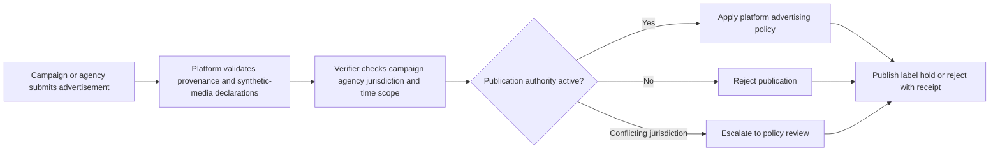
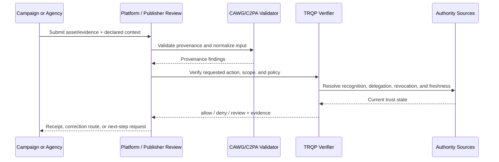
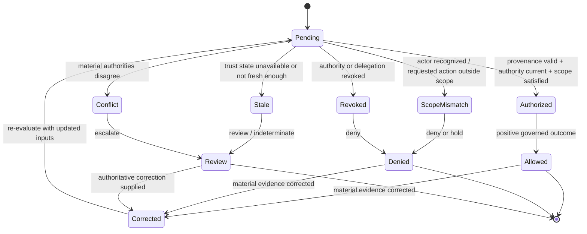

# Political Campaign Advertising

## Purpose and decision boundary

A platform receives media represented as an authorized campaign communication. The verifier checks campaign recognition, agency delegation, jurisdiction, expiry, and synthetic-media disclosure without judging political truth.

The decision is deliberately narrow:

> **May this asset be used for campaign communication under the authority, scope, policy, and trust state recorded at decision time?**

A successful result does not establish factual truth, legal liability, professional judgment, product authenticity, clinical validity, or entitlement beyond that scoped action.

## Plain-language summary

A campaign, candidate organization, or authorized agency submits media for political advertising. The platform needs to know whether the submitting actor is recognized, whether it has authority to act for the campaign in the relevant jurisdiction and time window, and whether provenance and policy requirements for the ad have been satisfied.

A positive result means **the media may enter the campaign-advertising workflow under the configured authority and disclosure rules**. It does not establish that the political claims are true, lawful in every jurisdiction, or acceptable under all platform policies. Those remain separate content, legal, and policy decisions. The verifier makes one important part of the decision—the authority to submit or publish—explicit and replayable.

## At-a-glance governance flow



The flow verifies communication authority and required disclosures; it does not assess whether political claims are true.


## Cross-functional interaction view

This swimlane-style interaction view shows how evidence moves between the submitting actor, the relying workflow, provenance validation, governed authority resolution, and the bounded operational decision.



## Governed decision state model

This state model keeps the governance lifecycle explicit so authorization, scope failure, revocation, stale trust state, conflict, and superseding correction are visible rather than collapsed into a single pass/fail result.



## Why this workflow needs verifiable governance

Political advertising combines rapidly changing authority, jurisdiction-specific rules, disclosure duties, and high public-interest stakes. Agencies may act for multiple campaigns, campaign officers may change, and a platform may need to withdraw publication authority quickly. Treating account authentication as sufficient authority is therefore a weak control.

CAWG-TRQP can bind the requested publication action to the campaign, candidate, jurisdiction, channel, election period, and current mandate. It also exposes stale or conflicting authority state rather than forcing a binary answer, which is important when escalation and transparency are preferable to silent publication.

## Roles in the workflow

| Role | Responsibility | Evidence expected |
|---|---|---|
| Submitter | Supplies the asset and declared context | CAWG/C2PA-derived integration signal |
| Governing authority | Defines who may perform `publish_campaign_ad` | Signed policy and recognition information |
| Relying service | Applies the decision to its own workflow | Decision receipt and reason codes |
| Affected party | May challenge metadata, authority, or use | Correction, appeal, or redress reference |
| Assurance reviewer | Replays and audits the decision | Pinned inputs and audit bundle |


## System components mapped to workflow concepts

| Workflow concept | Verifier concept | Practical meaning |
|---|---|---|
| Campaign/committee identity | Authority domain | Identifies the governed political entity |
| Agency or officer mandate | Recognition/delegation | Shows who may submit or authorize media |
| Jurisdiction/election window | Context scope | Restricts authority to the applicable campaign context |
| Mandate withdrawal | Revocation state | Stops future publication decisions after authority changes |
| Platform election-integrity review | Review disposition | Routes conflict without turning the verifier into a truth arbiter |

## Governance concerns

- **Jurisdictional Scope:** represented as explicit policy, context, evidence, or review requirements.
- **Rapid Revocation:** represented as explicit policy, context, evidence, or review requirements.
- **Agency Delegation:** represented as explicit policy, context, evidence, or review requirements.
- **Public Decision Accountability:** represented as explicit policy, context, evidence, or review requirements.

## End-to-end sequence

1. Validate the content-authenticity input and normalize it into the CAWG-TRQP integration signal.
2. Resolve the actor, `platform` authority source, and relevant delegation chain.
3. Evaluate `publish_campaign_ad` against asset, resource, jurisdiction, purpose, and time scope.
4. Check revocation, freshness, descriptor integrity, and any profile-specific fail-closed requirements.
5. Return `allow`, `deny`, `indeterminate`, or `review` with stable reason codes.
6. Issue a decision receipt that identifies the policy epoch, authority evidence, verifier version, and evidence minimization profile.
7. Preserve replay inputs. A corrected or superseding decision creates a new receipt rather than mutating the historical record.

## Required cases

| Case | Expected outcome | Assurance point |
|---|---|---|
| Authorized and in scope | `allow` | Positive path is reproducible |
| Recognized but scope mismatch | `deny` | Recognition is not authorization |
| Revoked authority | `deny` | Revocation is enforced |
| Stale or unavailable authority state | `indeterminate` or `review` | Missing evidence never silently becomes trusted |
| Conflicting authorities | `review` | Conflict is visible and routed |
| Corrected metadata | new decision | History remains immutable and auditable |

## Runnable evidence package

The companion directory [`examples/political-campaign-advertising/`](../../examples/political-campaign-advertising/README.md) contains a machine-readable scenario manifest and expected outcomes. Run:

```bash
python scripts/validate_walkthrough_examples.py
```

## What evidence is produced

- scoped decision and stable reason codes;
- authority, delegation, and revocation evidence references;
- policy and context-profile versions;
- minimized decision receipt;
- replay inputs and correction lineage; and
- an explicit review or redress route for contested decisions.

## What this walkthrough does not prove

This walkthrough does not convert provenance into truth and does not transfer institutional accountability to the verifier. The relying organization remains responsible for the lawful, proportionate, and procedurally fair use of the result.

## What can be tested

| Test question | Artifact or command |
|---|---|
| Do the walkthrough diagrams and required reader-facing sections pass quality validation? | `python scripts/validate_walkthrough_quality.py` |
| Do Mermaid flow, interaction, and state diagrams pass structural validation? | `python scripts/validate_walkthrough_diagrams.py` |
| Do machine-readable walkthrough manifests contain the common lifecycle cases? | `python scripts/validate_walkthrough_examples.py` |
| Do shipped example artefacts remain structurally valid? | `python scripts/validate_examples.py` |
| Does the complete repository validation surface pass? | `make validate` |

## Why this improves adoption

This walkthrough is easier to adopt when the governance value is expressed in familiar operational terms:

- campaigns and agencies receive precise scope-based outcomes instead of generic account failures;
- platform election-integrity teams can separate sponsor authority from claim evaluation;
- revocation and personnel changes propagate into future authorization decisions;
- public-interest review can reconstruct which authority and policy state applied to a specific ad decision.

## Governance interpretation

The verifier should never be treated as a political truth engine. Its role is narrower: evaluate whether the identified actor had the configured authority to perform the requested campaign-media action under the policy state in force.

Platforms, election authorities, courts, and other institutions retain their respective legal and policy responsibilities. This separation supports auditability without centralizing political judgment in the trust registry or verifier.

## Agentic AI Variant

Introducing an agent into **Political Campaign Advertising** changes the assurance problem from actor recognition alone to delegated-action assurance. Apply the common [Agentic AI Assurance model](../agentic-ai/index.md) and treat agent identity as necessary but insufficient evidence.

| Agentic control | Walkthrough requirement |
|---|---|
| Agent role | Model the agent explicitly as **producer, campaign submitter, verifier, placement orchestrator, or compliance assistant**; authority in one role MUST NOT imply authority in another. |
| Principal | Bind the agent to **candidate, campaign, party, authorized committee, platform, or regulator** and retain the principal reference in the decision evidence. |
| Delegated authority | Verify a mandate for the exact requested operation; authentication or recognition of the agent alone is not authorization. |
| Scope | Enforce **campaign/committee, creative asset, jurisdiction, placement channel, spend/approval threshold, and validity period** as applicable to the transaction. |
| Tool/sub-agent chain | Where the agent invokes tools or downstream agents, retain evidence of material calls and reject unauthorized sub-delegation. |
| Revocation | Evaluate principal and delegation state at the decision time; revoked or expired authority cannot authorize a new action. |
| Failure | Preserve explicit `deny`, `review`, and `indeterminate` outcomes rather than coercing uncertainty into permission. |
| Audit and redress | Retain agent, principal, mandate, policy epoch, provenance/authority evidence, and a correction or challenge route sufficient for replay. |

Authenticating agent authority and provenance does not establish legality, truthfulness, endorsement, or regulatory compliance beyond the specific machine-verifiable policies evaluated.

### Agentic conformance probes

In addition to the walkthrough's existing tests, exercise an authenticated agent with no mandate, a valid mandate with an out-of-scope action, revoked/expired delegation, prohibited sub-delegation or tool use, stale/conflicting authority state, and a corrected input that requires a superseding receipt.

## Operational assurance contract

This walkthrough is testable as a bounded governance decision rather than as a claim that the underlying content is true.

| Control point | Required behavior | Evidence |
|---|---|---|
| Decision | Evaluate **Campaign-media authorization** only | Stable outcome and reason code |
| Authority | Resolve campaign or authorized agent authority, delegation, scope, and current status | Authority and delegation references |
| Freshness | Apply the required revocation and trust-state freshness rules | Timestamped trust-state evidence |
| Policy | Pin the campaign-media policy epoch used for evaluation | Policy identifier/version or digest |
| Failure | Fail visibly on stale, unavailable, ambiguous, or conflicting authority state | `indeterminate`/`review` receipt rather than implicit trust |
| Correction | Preserve the original decision and issue a superseding receipt when material inputs change | Immutable receipt lineage |
| Handoff | Pass the result into **platform policy review** without transferring accountability to the verifier | Relying-party disposition/audit reference |

### Conformance assertions

An implementation claiming this walkthrough should be able to demonstrate that:

1. recognition alone never grants the requested action when scope or delegation is absent;
2. a revoked authority or delegation cannot produce a positive decision for the affected decision time;
3. stale or conflicting trust state is surfaced explicitly and never silently coerced to `allow`;
4. identical pinned inputs replay to the same governed outcome and reason code; and
5. a correction produces a new decision linked to, rather than overwriting, the historical receipt.

