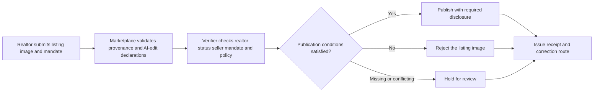
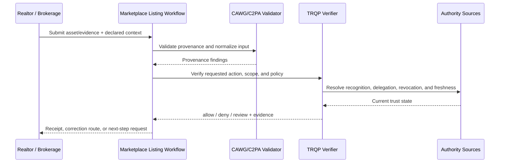
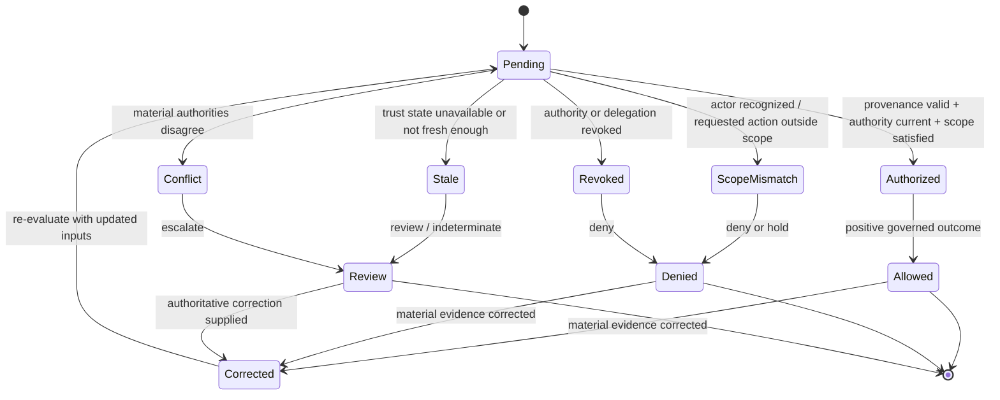
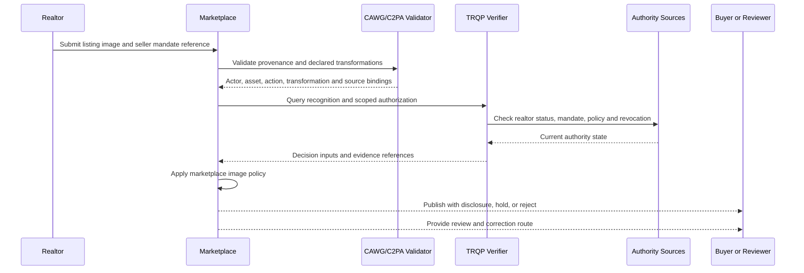

# AI-Assisted Property Listing Image Verification

Property listings increasingly use generative staging, object removal, lighting correction, and synthetic views. These techniques can improve presentation, but they can also misrepresent room dimensions, structural condition, views, fixtures, damage, or amenities. The governance problem is therefore not merely whether AI was used. It is whether the actor was authorized, the transformation was declared, the policy was enforceable, and the resulting decision can be challenged and replayed.

CAWG/C2PA can provide provenance and transformation assertions. TRQP can determine whether the realtor, seller mandate, issuer, and marketplace authority are recognized and current. Together, they enable a marketplace to enforce a scoped policy rather than relying on an unverified badge or a free-text declaration.

## Decision boundary

This workflow does not treat content credentials as proof that a property matches the image. Physical accuracy still requires inspections, surveys, seller disclosures, and applicable legal remedies. CAWG-TRQP instead establishes a verifiable chain for who submitted the image, what was declared, which authority applied, and why the platform accepted, labelled, held, or rejected it.

## Plain-language summary

A realtor or brokerage submits a listing image that may include virtual staging, object removal, lighting adjustment, or generative edits. The marketplace needs to know whether the actor has a current seller/brokerage mandate for the property, whether the transformation was declared, and whether the edit class is allowed under the listing policy.

A positive or conditionally trusted result means **the image may be published under the required disclosure and authority conditions**. It does not prove that the physical property matches the image, that the listing is legally accurate, or that inspection can be waived. The verifier makes authorization and transformation-policy enforcement visible while preserving those separate consumer-protection duties.

## At-a-glance governance flow

The flow governs authorization and disclosure while leaving physical property accuracy to inspections, surveys, and legal duties.

## Cross-functional interaction view

This swimlane-style interaction view shows how evidence moves between the submitting actor, the relying workflow, provenance validation, governed authority resolution, and the bounded operational decision.

## Governed decision state model

This state model keeps the governance lifecycle explicit so authorization, scope failure, revocation, stale trust state, conflict, and superseding correction are visible rather than collapsed into a single pass/fail result.

## Why this workflow needs verifiable governance

AI-assisted listing imagery makes provenance alone insufficient. A content credential can accurately report that an image was transformed while the marketplace still needs to decide whether the transformation is permissible, whether disclosure is required, and whether the actor was authorized to publish it for this property.

CAWG-TRQP provides the missing governance layer around those questions. It binds property, seller mandate, transformation class, publication channel, and policy epoch so an allowed edit and a deceptive alteration do not receive the same operational treatment merely because both have valid provenance.

## Roles in the workflow

| Actor | Authority or responsibility |
|---|---|
| Seller | Grants and may revoke the listing mandate |
| Realtor or listing agent | Submits images within the mandate and applicable professional scope |
| Marketplace | Defines image policy and makes the publication decision |
| Realtor registry or licensing body | Supplies current recognition or disciplinary status where available |
| CAWG/C2PA validator | Validates manifest integrity and transformation assertions |
| TRQP verifier | Resolves recognition, mandate, policy, and revocation state |
| Buyer or affected party | Receives disclosure and can raise a challenge |
| Reviewer or regulator | Replays the decision from retained evidence |

## System components mapped to workflow concepts

| Workflow concept | Verifier concept | Practical meaning |
|---|---|---|
| Property/listing identifier | Resource scope | Binds the image and mandate to the intended property |
| Seller/brokerage mandate | Recognition/delegation | Shows who may create or publish listing media |
| Transformation class | Policy/process scope | Distinguishes permitted staging from prohibited material alteration |
| Mandate withdrawal | Revocation state | Stops future listing-image publication after authority changes |
| Disclosure/marketplace review | Conditional/review disposition | Allows policy-sensitive outcomes without claiming physical accuracy |

## End-to-end flow

## Policy outcomes

| Condition | Outcome |
|---|---|
| Authorized realtor, active mandate, declared non-structural generative staging | Publish with prominent AI-edit disclosure |
| Missing provenance but no other adverse signal | Hold for manual review |
| Undeclared AI edit | Reject and preserve evidence |
| Fabricated view, amenity, room size, or structural condition | Reject and escalate under marketplace policy |
| Expired or revoked seller mandate | Reject |
| Conflicting actor or property binding | Quarantine and investigate |
| Stale registry or revocation data | Re-query or downgrade according to the declared failure policy |

## Controls that CAWG-TRQP adds

1. **Authority binding:** the image is connected to an actor who is recognized and authorized for the specific listing.
2. **Transformation accountability:** declared AI edits are bound to validated assertions rather than free-text claims.
3. **Scoped enforcement:** the policy distinguishes acceptable virtual staging from prohibited structural or factual fabrication.
4. **Revocation:** a withdrawn seller mandate or suspended actor can invalidate future publication decisions.
5. **Evidence and redress:** the marketplace produces a decision receipt that can be replayed during a buyer complaint, seller dispute, professional review, or regulatory inquiry.

## Runnable example

The machine-readable package is in [`examples/property-listing-ai-images`](../../examples/property-listing-ai-images/README.md). Its expected result is `conditionally_trusted`: the image may be published only with a prominent disclosure because generative staging was used.

## Assurance tests

A conforming implementation should test at least:

- authorized and unauthorized realtors;
- active, expired, and revoked seller mandates;
- declared and undeclared generative edits;
- allowed non-structural staging and prohibited structural alteration;
- mismatched listing and property identifiers;
- stale or unavailable authority sources;
- disclosure rendering and accessibility;
- evidence retention, correction, and appeal replay.

## What evidence is produced

| Evidence artifact | Primary user | What it establishes |
|---|---|---|
| Normalized verification request | Implementer / reviewer | Which actor, resource, action, context, and evidence entered the decision |
| Decision receipt | Relying party / affected party | Outcome, reason codes, policy epoch, and the bounded basis for the decision |
| Authority and revocation references | Assurance reviewer | Which governed trust sources were relied upon and their evaluated state |
| Replay inputs or audit bundle | Auditor / maintainer | Whether the original decision can be reconstructed from pinned evidence |
| Superseding receipt or correction lineage | Reviewer / affected party | How a material correction changed a later decision without rewriting history |

## What can be tested

| Test question | Artifact or command |
|---|---|
| Do the walkthrough diagrams and required reader-facing sections pass quality validation? | `python scripts/validate_walkthrough_quality.py` |
| Do Mermaid flow, interaction, and state diagrams pass structural validation? | `python scripts/validate_walkthrough_diagrams.py` |
| Do machine-readable walkthrough manifests contain the common lifecycle cases? | `python scripts/validate_walkthrough_examples.py` |
| Do shipped example artefacts remain structurally valid? | `python scripts/validate_examples.py` |
| Does the complete repository validation surface pass? | `make validate` |

## Why this improves adoption

This walkthrough is easier to adopt when the governance value is expressed in familiar operational terms:

- realtors get clear guidance on which AI edits require disclosure or fail policy;
- marketplaces can enforce transformation policy consistently at scale;
- buyers can receive stronger provenance/disclosure evidence without being told the image proves physical reality;
- complaints and regulatory review can replay the authority, transformation, and policy state used at publication.

## Governance interpretation

The marketplace owns the listing and disclosure policy; sellers and brokerages supply the relevant authority; inspectors and legal regimes govern physical accuracy and transactional duties. The verifier connects the first two without displacing the latter.

That boundary is particularly important for generative media: transparent provenance plus scoped authority can improve accountability, but neither should be represented as a substitute for inspection or truthful-description obligations.

## Agentic AI Variant

Introducing an agent into **AI-Assisted Property Listing Image Verification** changes the assurance problem from actor recognition alone to delegated-action assurance. Apply the common [Agentic AI Assurance model](../agentic-ai/index.md) and treat agent identity as necessary but insufficient evidence.

| Agentic control | Walkthrough requirement |
|---|---|
| Agent role | Model the agent explicitly as **producer, submitter, verifier, or buyer-side orchestrator**; authority in one role MUST NOT imply authority in another. |
| Principal | Bind the agent to **seller, brokerage, marketplace, or buyer** and retain the principal reference in the decision evidence. |
| Delegated authority | Verify a mandate for the exact requested operation; authentication or recognition of the agent alone is not authorization. |
| Scope | Enforce **listing/property identifier, permitted transformation class, publication channel, purpose, and mandate validity** as applicable to the transaction. |
| Tool/sub-agent chain | Where the agent invokes tools or downstream agents, retain evidence of material calls and reject unauthorized sub-delegation. |
| Revocation | Evaluate principal and delegation state at the decision time; revoked or expired authority cannot authorize a new action. |
| Failure | Preserve explicit `deny`, `review`, and `indeterminate` outcomes rather than coercing uncertainty into permission. |
| Audit and redress | Retain agent, principal, mandate, policy epoch, provenance/authority evidence, and a correction or challenge route sufficient for replay. |

An AI agent may stage or enhance an image only within the seller/brokerage mandate; a buyer-side verifier agent may authenticate provenance and mandate state but cannot infer that the physical property matches the image or autonomously waive inspection/legal duties.

### Agentic conformance probes

In addition to the walkthrough's existing tests, exercise an authenticated agent with no mandate, a valid mandate with an out-of-scope action, revoked/expired delegation, prohibited sub-delegation or tool use, stale/conflicting authority state, and a corrected input that requires a superseding receipt.

## Operational assurance contract

This walkthrough is testable as a bounded governance decision rather than as a claim that the underlying content is true.

| Control point | Required behavior | Evidence |
|---|---|---|
| Decision | Evaluate **Listing-image acceptance** only | Stable outcome and reason code |
| Authority | Resolve brokerage or delegated agent authority, delegation, scope, and current status | Authority and delegation references |
| Freshness | Apply the required revocation and trust-state freshness rules | Timestamped trust-state evidence |
| Policy | Pin the listing disclosure policy epoch used for evaluation | Policy identifier/version or digest |
| Failure | Fail visibly on stale, unavailable, ambiguous, or conflicting authority state | `indeterminate`/`review` receipt rather than implicit trust |
| Correction | Preserve the original decision and issue a superseding receipt when material inputs change | Immutable receipt lineage |
| Handoff | Pass the result into **property listing workflow** without transferring accountability to the verifier | Relying-party disposition/audit reference |

### Conformance assertions

An implementation claiming this walkthrough should be able to demonstrate that:

1. recognition alone never grants the requested action when scope or delegation is absent;
2. a revoked authority or delegation cannot produce a positive decision for the affected decision time;
3. stale or conflicting trust state is surfaced explicitly and never silently coerced to `allow`;
4. identical pinned inputs replay to the same governed outcome and reason code; and
5. a correction produces a new decision linked to, rather than overwriting, the historical receipt.

