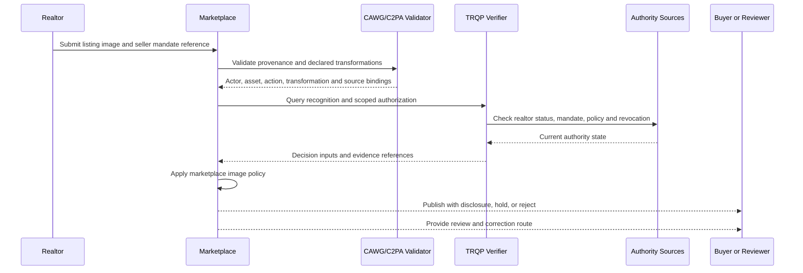

# AI-Assisted Property Listing Image Verification

Property listings increasingly use generative staging, object removal, lighting correction, and synthetic views. These techniques can improve presentation, but they can also misrepresent room dimensions, structural condition, views, fixtures, damage, or amenities. The governance problem is therefore not merely whether AI was used. It is whether the actor was authorized, the transformation was declared, the policy was enforceable, and the resulting decision can be challenged and replayed.

CAWG/C2PA can provide provenance and transformation assertions. TRQP can determine whether the realtor, seller mandate, issuer, and marketplace authority are recognized and current. Together, they enable a marketplace to enforce a scoped policy rather than relying on an unverified badge or a free-text declaration.

## Decision boundary

This workflow does not treat content credentials as proof that a property matches the image. Physical accuracy still requires inspections, surveys, seller disclosures, and applicable legal remedies. CAWG-TRQP instead establishes a verifiable chain for who submitted the image, what was declared, which authority applied, and why the platform accepted, labelled, held, or rejected it.

## Actors and authority

| Actor | Authority or responsibility |
|---|---|
| Seller | Grants and may revoke the listing mandate |
| Realtor or listing agent | Submits images within the mandate and applicable professional scope |
| Marketplace | Defines image policy and makes the publication decision |
| Realtor registry or licensing body | Supplies current recognition or disciplinary status where available |
| CAWG/C2PA validator | Validates manifest integrity and transformation assertions |
| TRQP verifier | Resolves recognition, mandate, policy, and revocation state |
| Buyer or affected party | Receives disclosure and can raise a challenge |
| Reviewer or regulator | Replays the decision from retained evidence |

## End-to-end flow

## Policy outcomes

| Condition | Outcome |
|---|---|
| Authorized realtor, active mandate, declared non-structural generative staging | Publish with prominent AI-edit disclosure |
| Missing provenance but no other adverse signal | Hold for manual review |
| Undeclared AI edit | Reject and preserve evidence |
| Fabricated view, amenity, room size, or structural condition | Reject and escalate under marketplace policy |
| Expired or revoked seller mandate | Reject |
| Conflicting actor or property binding | Quarantine and investigate |
| Stale registry or revocation data | Re-query or downgrade according to the declared failure policy |

## Controls that CAWG-TRQP adds

1. **Authority binding:** the image is connected to an actor who is recognized and authorized for the specific listing.
2. **Transformation accountability:** declared AI edits are bound to validated assertions rather than free-text claims.
3. **Scoped enforcement:** the policy distinguishes acceptable virtual staging from prohibited structural or factual fabrication.
4. **Revocation:** a withdrawn seller mandate or suspended actor can invalidate future publication decisions.
5. **Evidence and redress:** the marketplace produces a decision receipt that can be replayed during a buyer complaint, seller dispute, professional review, or regulatory inquiry.

## Runnable example

The machine-readable package is in [`examples/property-listing-ai-images`](../../examples/property-listing-ai-images/README.md). Its expected result is `conditionally_trusted`: the image may be published only with a prominent disclosure because generative staging was used.

## Assurance tests

A conforming implementation should test at least:

- authorized and unauthorized realtors;
- active, expired, and revoked seller mandates;
- declared and undeclared generative edits;
- allowed non-structural staging and prohibited structural alteration;
- mismatched listing and property identifiers;
- stale or unavailable authority sources;
- disclosure rendering and accessibility;
- evidence retention, correction, and appeal replay.
