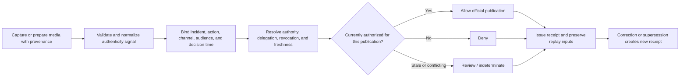
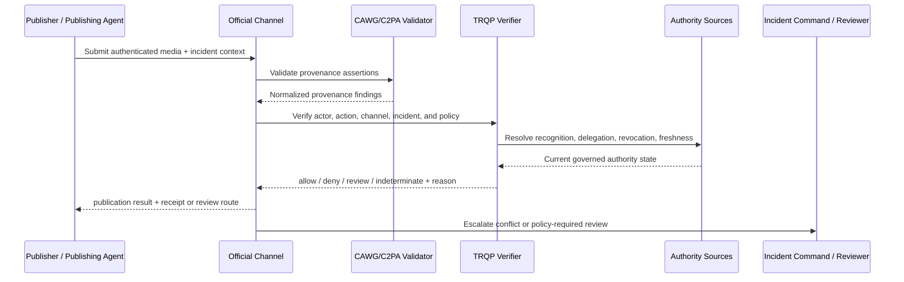
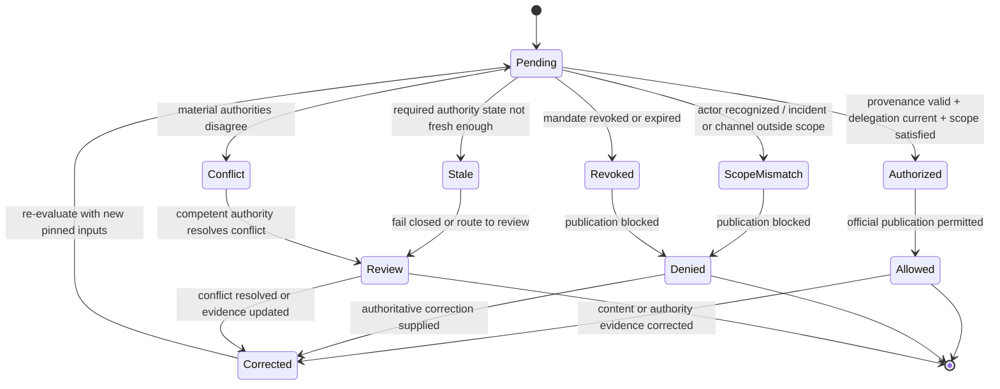

# Official Public-Safety Communications

## Purpose and decision boundary

This walkthrough applies the verifier to official emergency, public-safety, and incident-response communications that include authenticated media or CAWG/C2PA-style provenance evidence.

The bounded governance question is:

> **May this authenticated media asset be published or redistributed as an official public-safety communication by this actor, for this incident, channel, audience, and decision time?**

A positive result establishes only that the configured provenance, authority, delegation, scope, policy, and trust-state conditions for the requested publication action were satisfied. It does not establish that the underlying event description is factually complete, that the recommended response is clinically or operationally optimal, or that a public authority has satisfied every legal duty associated with emergency communication.

## Plain-language summary

A wildfire agency, emergency management office, public-health authority, transport operator, police service, utility, or other competent body may need to publish authenticated photographs, video, maps, warnings, or status media during a fast-moving incident. The organization often delegates communication rights to named officers, incident teams, communications contractors, mutual-aid partners, or automated publishing systems.

The problem is not merely whether the media has valid provenance. The relying channel also needs to know whether the person, service, or agent is currently authorized to publish on behalf of the competent authority, whether that authority covers the specific incident and channel, and whether the authorization has been revoked, expired, superseded, or placed into a review state.

This makes public-safety communication a useful high-assurance example because **provenance and authority can both be valid independently while the requested publication is still unauthorized**. A genuine image captured by a recognized emergency worker is not automatically an official statement. Likewise, an authenticated communications account should not be able to keep publishing after its emergency delegation has been revoked.

## At-a-glance governance flow



The flow deliberately separates provenance validation from the institutional decision about who may communicate officially.

## Cross-functional interaction view



## Governed decision state model



## Why official communications need verifiable governance

Emergency communication systems are often optimized for speed, but speed increases the cost of ambiguous authority. During an incident, multiple organizations may be producing legitimate media at once: municipal teams, emergency services, contractors, utilities, journalists, volunteers, and mutual-aid responders. Authentic provenance does not answer which of those actors may speak officially for a particular authority.

Delegations are also unusually dynamic. An incident commander may temporarily authorize a field officer or communications cell to publish evacuation imagery for a defined incident and period. A mutual-aid organization may be permitted to redistribute, but not originate, official messaging. A contractor may prepare media while an authorized officer retains final publishing authority. A machine agent may assemble and queue content while its mandate forbids autonomous release.

The verifier provides a machine-verifiable enforcement point for those boundaries. It allows the relying channel to distinguish a recognized actor from an authorized publisher, apply revocation immediately, preserve stale or conflicting authority state as non-positive evidence, and produce a receipt explaining which policy and trust state governed the publication decision.

## Roles in the workflow

| Role | Responsibility | Evidence expected |
|---|---|---|
| Competent public authority | Owns the official communication mandate and policy | trust anchor, recognition, delegation policy |
| Incident command / responsible officer | Defines incident-specific communication scope | incident mandate, time window, channel scope |
| Content producer | Captures or prepares media | CAWG/C2PA-style provenance evidence |
| Publisher or publishing agent | Requests publication on an official channel | actor identity, delegation, requested action/context |
| Official channel | Enforces the bounded publication decision | verifier result, reason code, receipt |
| Reviewer / duty officer | Resolves policy-required conflict or uncertainty | review decision and superseding evidence |
| Auditor / incident reviewer | Replays decisions after the event | pinned policy, authority state, receipts, replay bundle |

## System components mapped to workflow concepts

| Public-safety concept | Verifier concept | Practical meaning |
|---|---|---|
| Emergency-management authority | trust/recognition authority | establishes which organization may issue the official communication |
| Incident commander or delegated communications officer | delegation chain | establishes who may act for the authority |
| Publish / redistribute / update / withdraw | action scope | prevents one communication permission becoming universal authority |
| Incident identifier or affected region | resource/context scope | binds the mandate to a concrete emergency or operational context |
| Official web/social/alert channel | channel/recipient context | prevents an authority valid for one channel being reused everywhere |
| Expiry, stand-down, reassignment | revocation/temporal state | terminates temporary incident authority |
| Conflicting command structures | authority conflict | preserves disagreement for institutional resolution |
| Corrected warning or media | superseding receipt | preserves history while allowing authoritative correction |

## Governance concerns

- **Authority source:** the relying system MUST know which entity is competent to authorize official communication for the relevant incident and jurisdiction.
- **Delegation scope:** recognition or employment MUST NOT substitute for a mandate to publish.
- **Incident binding:** temporary authority SHOULD be bound to an incident, operational period, or comparable context rather than treated as standing universal permission.
- **Channel scope:** authority to prepare, publish, redistribute, update, and withdraw SHOULD be independently expressible where the workflow distinguishes those actions.
- **Revocation:** stand-down, reassignment, credential compromise, contractor termination, or incident-command change MUST be enforceable for new publication decisions.
- **Freshness:** high-assurance channels SHOULD fail closed or route to review when required authority state cannot be established within policy freshness limits.
- **Conflict:** disagreement between competent sources MUST remain visible and MUST NOT be coerced into an allow result.
- **Correction:** corrected warnings or media MUST create additive superseding evidence rather than rewriting the historical decision trail.

## End-to-end sequence

1. Capture or prepare the media and preserve the provenance assertions needed by the relying workflow.
2. Normalize only the authenticity evidence required for the publication decision.
3. Bind the verification request to the publishing actor, requested action, incident/resource, official channel, audience/purpose where applicable, and decision time.
4. Resolve the competent authority and each material delegation hop to the publisher or agent.
5. Evaluate delegation scope, expiry, revocation, and required trust-state freshness.
6. Return `allow`, `deny`, `indeterminate`, or `review` with a stable reason code.
7. On `allow`, permit the bounded publication action only; do not infer permission for unrelated channels or future incidents.
8. Issue a minimized decision receipt and preserve the inputs required for replay.
9. Where a warning, image, mandate, or authority record is corrected, produce a new linked decision rather than mutating the historical receipt.

## Decision and failure matrix

| Condition | Expected outcome | Governance meaning |
|---|---|---|
| Provenance valid, publisher delegated, incident/channel in scope | `allow` | bounded official publication may proceed |
| Recognized emergency worker, no publication mandate | `deny` | recognition does not confer speaking authority |
| Valid publisher mandate, wrong incident or channel | `deny` | delegation is context-specific |
| Communications mandate revoked or expired | `deny` | stand-down/revocation is enforceable |
| Required authority state is stale or unavailable | `indeterminate` | uncertainty is not converted into permission |
| Two competent authority sources conflict | `review` | institutional conflict remains explicit |
| Message or authority evidence corrected | new decision | superseding evidence preserves historical lineage |

## Runnable evidence package

The companion directory [`examples/public-safety-official-communications/`](../../examples/public-safety-official-communications/README.md) contains the machine-readable scenario contract and expected lifecycle outcomes.

Validate the walkthrough portfolio with:

```bash
python scripts/validate_walkthrough_examples.py
python scripts/validate_walkthrough_quality.py
python scripts/validate_walkthrough_diagrams.py
```

The scenario manifest uses the same lifecycle vocabulary as the rest of the portfolio: authorized, scope mismatch, revoked, stale, conflict, and corrected.

## What evidence is produced

A conforming implementation should be able to preserve, subject to minimization and retention policy:

- normalized provenance/assertion findings;
- competent authority reference;
- delegation chain to the publisher or publishing agent;
- incident/resource and channel scope;
- revocation and expiry status;
- policy/profile epoch and decision time;
- outcome and stable reason code;
- minimized decision receipt;
- replay inputs or evidence references; and
- correction, review, or redress lineage.

## What can be tested

| Test question | Artifact or command |
|---|---|
| Does an authorized publisher for the correct incident/channel receive an allow? | `examples/public-safety-official-communications/scenario.json` |
| Does recognized-but-undelegated publishing fail? | scope-mismatch case |
| Does revoked or expired incident authority fail? | revoked case |
| Does stale required authority state avoid a positive decision? | stale case |
| Does conflicting command authority route to review? | conflict case |
| Does correction require new linked evidence? | corrected case |
| Does the document meet the common quality baseline? | `python scripts/validate_walkthrough_quality.py` |
| Do the Mermaid views meet structural validation? | `python scripts/validate_walkthrough_diagrams.py` |
| Does the machine-readable scenario satisfy the portfolio contract? | `python scripts/validate_walkthrough_examples.py` |
| Does the complete repository gate pass? | `make validate` |

## Why this improves adoption

This scenario gives emergency-management and critical-infrastructure teams a concrete way to reason about authenticated official media without claiming that provenance technology decides operational truth. It makes several operational benefits testable:

- official channels can enforce incident-specific publishing mandates;
- temporary communication rights can expire or be revoked without changing content provenance;
- mutual-aid and contractor roles can be modeled as bounded delegation rather than blanket trust;
- machine agents can be constrained to preparation, recommendation, or publication roles independently;
- post-incident review can reconstruct which authority and policy state supported each publication decision; and
- corrections remain visible as governance events rather than silent edits to history.

The pattern also generalizes beyond emergency management to utilities, transport disruption notices, public-health advisories, campus alerts, and other communications where the distinction between authentic media and authorized official speech matters.

## Governance interpretation

The verifier is a publication-authority enforcement component, not an emergency-management decision-maker. It can establish that the configured provenance and authorization conditions were satisfied for a bounded communication action. The competent authority remains responsible for factual verification, operational judgment, legal compliance, accessibility, proportionality, public-record obligations, and the consequences of issuing or withholding the communication.

This separation is essential. A cryptographically authenticated warning can still be wrong; a factually correct image can still be published by an unauthorized actor. Executable governance must preserve both possibilities instead of collapsing them into a single concept of trust.

## Agentic AI Variant

An AI agent may prepare, translate, summarize, queue, redistribute, or publish public-safety content. Treat the agent as a delegated actor, not as an autonomous source of institutional authority.

| Agentic control | Walkthrough requirement |
|---|---|
| Agent role | Distinguish producer, translator, recommender, publisher, redistributor, and verifier roles. |
| Principal | Bind the agent to the competent authority or an explicitly delegated operational unit. |
| Mandate | Require authority for the exact requested publication operation. |
| Incident scope | Bind temporary authority to the incident, geography, audience, and operational period where applicable. |
| Tool/sub-agent use | Record material downstream publishing tools and prohibit unauthorized sub-delegation. |
| Revocation | Terminate new actions immediately when the mandate, principal authority, or tool authorization is revoked. |
| Human review | Preserve policy-required approval points for high-consequence or conflicting communications. |
| Audit/redress | Retain principal, mandate, policy epoch, provenance/authority evidence, agent/tool lineage, and correction references. |

An authenticated agent with access to an official publishing API is not thereby authorized to issue an emergency communication. Tool access and actor identity are evidence inputs; the scoped mandate remains the governing authority.

### Agentic conformance probes

Exercise at least these cases: authenticated agent with no publishing mandate; valid preparation mandate but attempted autonomous publication; valid incident mandate used for a different incident; expired delegation; revoked tool authorization; prohibited sub-agent handoff; stale or conflicting authority state; and a corrected warning that requires a superseding receipt.

## Operational assurance contract

An implementation claiming this walkthrough should demonstrate that:

1. publication authority is evaluated separately from content provenance;
2. action, incident/resource, channel, and decision-time scope are enforceable;
3. every material delegation hop is resolved rather than inferred from recognition alone;
4. revoked or expired authority cannot authorize a new publication;
5. stale required state cannot yield an implicit positive result;
6. conflicting authority is preserved as reviewable evidence;
7. replay over identical pinned inputs yields the same outcome and reason code; and
8. corrections create linked superseding evidence rather than destructive mutation.

## What this walkthrough does not prove

The verifier does not determine whether an emergency exists, whether a warning is factually correct, whether operational advice is safe, whether the selected audience or channel is legally sufficient, or whether the authority has fulfilled its statutory duties. Those remain substantive responsibilities of the competent public institution and its accountable decision-makers.
