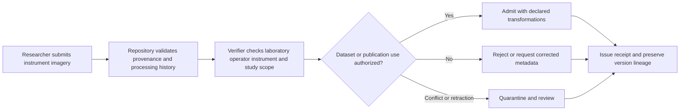
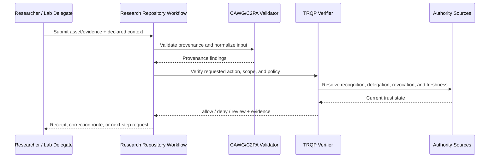
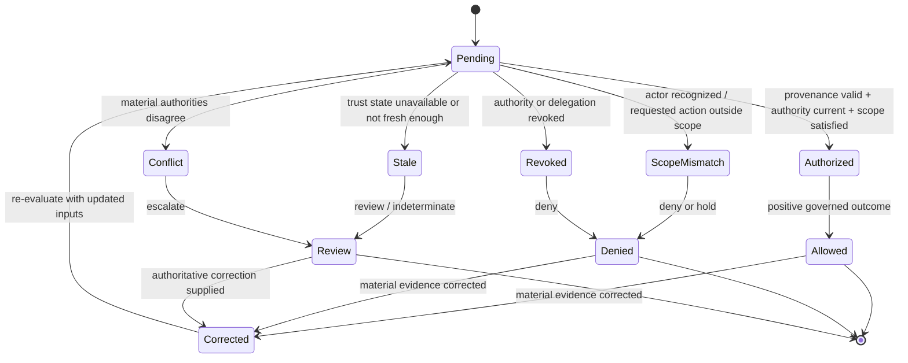

# Scientific Research Imagery

## Purpose and decision boundary

A laboratory submits instrument-generated imagery for a dataset or publication. The verifier records laboratory, operator, instrument, processing history, and correction or retraction status.

The decision is deliberately narrow:

> **May this asset be used for research dataset or publication under the authority, scope, policy, and trust state recorded at decision time?**

A successful result does not establish factual truth, legal liability, professional judgment, product authenticity, clinical validity, or entitlement beyond that scoped action.

## Plain-language summary

A researcher or laboratory submits imagery for a dataset, publication, repository, or collaborative analysis. The receiving institution needs to know whether the material is bound to the correct study, whether the actor is authorized to contribute it, whether provenance/process evidence satisfies the declared research policy, and whether corrections can be traced.

A positive result means **the asset may enter the identified research workflow under the recorded authority and evidence conditions**. It does not prove the scientific hypothesis, analytical validity, absence of misconduct, or reproducibility of the entire study. The verifier strengthens the governance around who contributed what, under which policy, and with which replayable evidence.

## At-a-glance governance flow



The decision establishes governed origin and permitted use; it does not independently validate the scientific conclusion.


## Cross-functional interaction view

This swimlane-style interaction view shows how evidence moves between the submitting actor, the relying workflow, provenance validation, governed authority resolution, and the bounded operational decision.



## Governed decision state model

This state model keeps the governance lifecycle explicit so authorization, scope failure, revocation, stale trust state, conflict, and superseding correction are visible rather than collapsed into a single pass/fail result.



## Why this workflow needs verifiable governance

Scientific images can persist for years and may be reused across papers, datasets, repositories, and collaborations. This makes provenance, correction lineage, and authority particularly important. A contributor may have been authorized for one study or dataset but not another, and a later correction should not erase the historical record used in an earlier analysis.

CAWG-TRQP provides a way to bind contribution authority and process evidence to the research context while preserving superseding decisions. It complements, rather than replaces, scientific review and reproducibility practices.

## Roles in the workflow

| Role | Responsibility | Evidence expected |
|---|---|---|
| Submitter | Supplies the asset and declared context | CAWG/C2PA-derived integration signal |
| Governing authority | Defines who may perform `admit_research_asset` | Signed policy and recognition information |
| Relying service | Applies the decision to its own workflow | Decision receipt and reason codes |
| Affected party | May challenge metadata, authority, or use | Correction, appeal, or redress reference |
| Assurance reviewer | Replays and audits the decision | Pinned inputs and audit bundle |


## System components mapped to workflow concepts

| Workflow concept | Verifier concept | Practical meaning |
|---|---|---|
| Study/dataset identifier | Resource scope | Binds the contribution to the intended research context |
| Researcher/lab role | Recognition/delegation | Shows who may contribute or approve the asset |
| Acquisition/processing policy | Policy/process evidence | Pins the declared requirements for generating or transforming imagery |
| Role or approval withdrawal | Revocation state | Stops obsolete authority from authorizing new contributions |
| Data correction/retraction | Superseding receipt | Preserves earlier decisions while recording corrected evidence |

## Governance concerns

- **Instrument Provenance:** represented as explicit policy, context, evidence, or review requirements.
- **Laboratory Authority:** represented as explicit policy, context, evidence, or review requirements.
- **Processing Declaration:** represented as explicit policy, context, evidence, or review requirements.
- **Retraction And Versioning:** represented as explicit policy, context, evidence, or review requirements.

## End-to-end sequence

1. Validate the content-authenticity input and normalize it into the CAWG-TRQP integration signal.
2. Resolve the actor, `research-institution` authority source, and relevant delegation chain.
3. Evaluate `admit_research_asset` against asset, resource, jurisdiction, purpose, and time scope.
4. Check revocation, freshness, descriptor integrity, and any profile-specific fail-closed requirements.
5. Return `allow`, `deny`, `indeterminate`, or `review` with stable reason codes.
6. Issue a decision receipt that identifies the policy epoch, authority evidence, verifier version, and evidence minimization profile.
7. Preserve replay inputs. A corrected or superseding decision creates a new receipt rather than mutating the historical record.

## Required cases

| Case | Expected outcome | Assurance point |
|---|---|---|
| Authorized and in scope | `allow` | Positive path is reproducible |
| Recognized but scope mismatch | `deny` | Recognition is not authorization |
| Revoked authority | `deny` | Revocation is enforced |
| Stale or unavailable authority state | `indeterminate` or `review` | Missing evidence never silently becomes trusted |
| Conflicting authorities | `review` | Conflict is visible and routed |
| Corrected metadata | new decision | History remains immutable and auditable |

## Runnable evidence package

The companion directory [`examples/scientific-research-imagery/`](../../examples/scientific-research-imagery/README.md) contains a machine-readable scenario manifest and expected outcomes. Run:

```bash
python scripts/validate_walkthrough_examples.py
```

## What evidence is produced

- scoped decision and stable reason codes;
- authority, delegation, and revocation evidence references;
- policy and context-profile versions;
- minimized decision receipt;
- replay inputs and correction lineage; and
- an explicit review or redress route for contested decisions.

## What this walkthrough does not prove

This walkthrough does not convert provenance into truth and does not transfer institutional accountability to the verifier. The relying organization remains responsible for the lawful, proportionate, and procedurally fair use of the result.

## What can be tested

| Test question | Artifact or command |
|---|---|
| Do the walkthrough diagrams and required reader-facing sections pass quality validation? | `python scripts/validate_walkthrough_quality.py` |
| Do Mermaid flow, interaction, and state diagrams pass structural validation? | `python scripts/validate_walkthrough_diagrams.py` |
| Do machine-readable walkthrough manifests contain the common lifecycle cases? | `python scripts/validate_walkthrough_examples.py` |
| Do shipped example artefacts remain structurally valid? | `python scripts/validate_examples.py` |
| Does the complete repository validation surface pass? | `make validate` |

## Why this improves adoption

This walkthrough is easier to adopt when the governance value is expressed in familiar operational terms:

- repositories can explain why an asset was admitted using stable evidence rather than institutional memory;
- collaborators can distinguish contributor authority from scientific validity;
- long-lived datasets retain correction and authority lineage;
- research-integrity or reproducibility reviews can replay the admission decision.

## Governance interpretation

Scientific governance requires a careful boundary between trusted process evidence and scientific truth. The verifier can show that an actor, asset, and workflow satisfied an institutional admission policy; peer review, methodological critique, statistical analysis, and research-integrity processes determine the scientific consequence.

This keeps the trust layer useful without granting it epistemic authority it does not possess.

## Agentic AI Variant

Introducing an agent into **Scientific Research Imagery** changes the assurance problem from actor recognition alone to delegated-action assurance. Apply the common [Agentic AI Assurance model](../agentic-ai/index.md) and treat agent identity as necessary but insufficient evidence.

| Agentic control | Walkthrough requirement |
|---|---|
| Agent role | Model the agent explicitly as **instrument/capture agent, processing agent, submitter, verifier, or reproducibility orchestrator**; authority in one role MUST NOT imply authority in another. |
| Principal | Bind the agent to **research institution, investigator, laboratory, repository, journal, or data steward** and retain the principal reference in the decision evidence. |
| Delegated authority | Verify a mandate for the exact requested operation; authentication or recognition of the agent alone is not authorization. |
| Scope | Enforce **study/dataset, instrument/run, permitted transformations, analysis purpose, repository/journal submission, and validity interval** as applicable to the transaction. |
| Tool/sub-agent chain | Where the agent invokes tools or downstream agents, retain evidence of material calls and reject unauthorized sub-delegation. |
| Revocation | Evaluate principal and delegation state at the decision time; revoked or expired authority cannot authorize a new action. |
| Failure | Preserve explicit `deny`, `review`, and `indeterminate` outcomes rather than coercing uncertainty into permission. |
| Audit and redress | Retain agent, principal, mandate, policy epoch, provenance/authority evidence, and a correction or challenge route sufficient for replay. |

Agentic provenance may establish how imagery was produced and under whose research authority, but it cannot establish scientific validity, statistical significance, or correctness of conclusions.

### Agentic conformance probes

In addition to the walkthrough's existing tests, exercise an authenticated agent with no mandate, a valid mandate with an out-of-scope action, revoked/expired delegation, prohibited sub-delegation or tool use, stale/conflicting authority state, and a corrected input that requires a superseding receipt.

## Operational assurance contract

This walkthrough is testable as a bounded governance decision rather than as a claim that the underlying content is true.

| Control point | Required behavior | Evidence |
|---|---|---|
| Decision | Evaluate **Research-image acceptance** only | Stable outcome and reason code |
| Authority | Resolve institution or delegated investigator authority, delegation, scope, and current status | Authority and delegation references |
| Freshness | Apply the required revocation and trust-state freshness rules | Timestamped trust-state evidence |
| Policy | Pin the research policy epoch used for evaluation | Policy identifier/version or digest |
| Failure | Fail visibly on stale, unavailable, ambiguous, or conflicting authority state | `indeterminate`/`review` receipt rather than implicit trust |
| Correction | Preserve the original decision and issue a superseding receipt when material inputs change | Immutable receipt lineage |
| Handoff | Pass the result into **research evidence workflow** without transferring accountability to the verifier | Relying-party disposition/audit reference |

### Conformance assertions

An implementation claiming this walkthrough should be able to demonstrate that:

1. recognition alone never grants the requested action when scope or delegation is absent;
2. a revoked authority or delegation cannot produce a positive decision for the affected decision time;
3. stale or conflicting trust state is surfaced explicitly and never silently coerced to `allow`;
4. identical pinned inputs replay to the same governed outcome and reason code; and
5. a correction produces a new decision linked to, rather than overwriting, the historical receipt.

