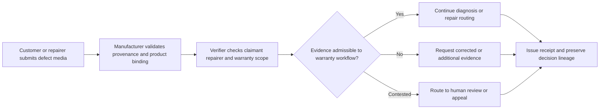
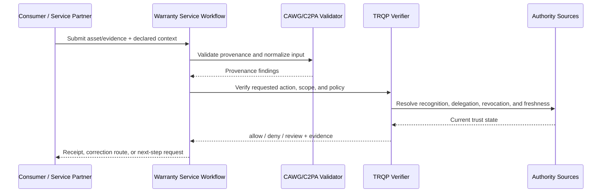
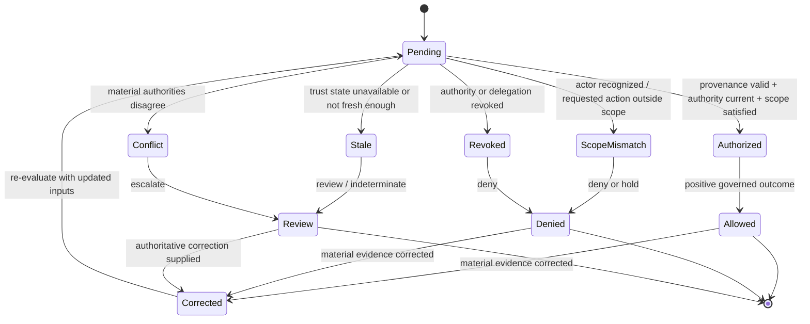

# Warranty and Repair Evidence

## Purpose and decision boundary

A consumer or authorized repairer submits imagery of a defect. The verifier supports product binding, submitter authority, privacy-preserving redaction, and correction without automatically deciding warranty liability.

The decision is deliberately narrow:

> **May this asset be used for warranty assessment under the authority, scope, policy, and trust state recorded at decision time?**

A successful result does not establish factual truth, legal liability, professional judgment, product authenticity, clinical validity, or entitlement beyond that scoped action.

## Plain-language summary

A consumer, repair center, technician, or service partner submits images or video for a warranty or repair process. The manufacturer or service network needs to know whether the evidence is linked to the correct product and service event, whether the submitter is authorized for the relevant action, and whether service-partner authority is current.

A positive result means **the evidence may be used for the defined warranty-assessment step**. It does not prove defect causation, warranty entitlement, repair quality, or reimbursement amount. Those remain separate commercial and technical decisions. The verifier helps create a consistent admission and evidence trail across distributed service networks.

## At-a-glance governance flow



Admission of evidence does not establish that the defect is covered or determine the final remedy.


## Cross-functional interaction view

This swimlane-style interaction view shows how evidence moves between the submitting actor, the relying workflow, provenance validation, governed authority resolution, and the bounded operational decision.



## Governed decision state model

This state model keeps the governance lifecycle explicit so authorization, scope failure, revocation, stale trust state, conflict, and superseding correction are visible rather than collapsed into a single pass/fail result.



## Why this workflow needs verifiable governance

Warranty ecosystems often rely on third-party service centers and technicians whose authority changes over time and may be limited by product line, geography, repair class, or contract. Authentic repair photos can still be attached to the wrong product, submitted by a suspended partner, or used outside the service mandate.

A governed verification step lets the manufacturer enforce those boundaries before evidence influences the claim. It also provides a better redress surface: the customer or service partner can challenge a specific authority, scope, or evidence problem instead of receiving an opaque rejection.

## Roles in the workflow

| Role | Responsibility | Evidence expected |
|---|---|---|
| Submitter | Supplies the asset and declared context | CAWG/C2PA-derived integration signal |
| Governing authority | Defines who may perform `admit_warranty_evidence` | Signed policy and recognition information |
| Relying service | Applies the decision to its own workflow | Decision receipt and reason codes |
| Affected party | May challenge metadata, authority, or use | Correction, appeal, or redress reference |
| Assurance reviewer | Replays and audits the decision | Pinned inputs and audit bundle |


## System components mapped to workflow concepts

| Workflow concept | Verifier concept | Practical meaning |
|---|---|---|
| Product/serial number | Resource scope | Binds evidence to the intended product |
| Service-partner authorization | Recognition/delegation | Shows who may inspect, repair, or submit evidence |
| Warranty/service action | Action scope | Separates evidence admission from entitlement or reimbursement |
| Partner suspension | Revocation state | Stops withdrawn service authority from being reused |
| Warranty escalation | Review disposition | Keeps ambiguous evidence visible for human resolution |

## Governance concerns

- **Serial Number Binding:** represented as explicit policy, context, evidence, or review requirements.
- **Repairer Delegation:** represented as explicit policy, context, evidence, or review requirements.
- **Consumer Appeal:** represented as explicit policy, context, evidence, or review requirements.
- **Minimal Evidence:** represented as explicit policy, context, evidence, or review requirements.

## End-to-end sequence

1. Validate the content-authenticity input and normalize it into the CAWG-TRQP integration signal.
2. Resolve the actor, `manufacturer` authority source, and relevant delegation chain.
3. Evaluate `admit_warranty_evidence` against asset, resource, jurisdiction, purpose, and time scope.
4. Check revocation, freshness, descriptor integrity, and any profile-specific fail-closed requirements.
5. Return `allow`, `deny`, `indeterminate`, or `review` with stable reason codes.
6. Issue a decision receipt that identifies the policy epoch, authority evidence, verifier version, and evidence minimization profile.
7. Preserve replay inputs. A corrected or superseding decision creates a new receipt rather than mutating the historical record.

## Required cases

| Case | Expected outcome | Assurance point |
|---|---|---|
| Authorized and in scope | `allow` | Positive path is reproducible |
| Recognized but scope mismatch | `deny` | Recognition is not authorization |
| Revoked authority | `deny` | Revocation is enforced |
| Stale or unavailable authority state | `indeterminate` or `review` | Missing evidence never silently becomes trusted |
| Conflicting authorities | `review` | Conflict is visible and routed |
| Corrected metadata | new decision | History remains immutable and auditable |

## Runnable evidence package

The companion directory [`examples/warranty-repair-evidence/`](../../examples/warranty-repair-evidence/README.md) contains a machine-readable scenario manifest and expected outcomes. Run:

```bash
python scripts/validate_walkthrough_examples.py
```

## What evidence is produced

- scoped decision and stable reason codes;
- authority, delegation, and revocation evidence references;
- policy and context-profile versions;
- minimized decision receipt;
- replay inputs and correction lineage; and
- an explicit review or redress route for contested decisions.

## What this walkthrough does not prove

This walkthrough does not convert provenance into truth and does not transfer institutional accountability to the verifier. The relying organization remains responsible for the lawful, proportionate, and procedurally fair use of the result.

## What can be tested

| Test question | Artifact or command |
|---|---|
| Do the walkthrough diagrams and required reader-facing sections pass quality validation? | `python scripts/validate_walkthrough_quality.py` |
| Do Mermaid flow, interaction, and state diagrams pass structural validation? | `python scripts/validate_walkthrough_diagrams.py` |
| Do machine-readable walkthrough manifests contain the common lifecycle cases? | `python scripts/validate_walkthrough_examples.py` |
| Do shipped example artefacts remain structurally valid? | `python scripts/validate_examples.py` |
| Does the complete repository validation surface pass? | `make validate` |

## Why this improves adoption

This walkthrough is easier to adopt when the governance value is expressed in familiar operational terms:

- consumers and service partners get explainable evidence-admission outcomes;
- manufacturers can apply one authority model across heterogeneous repair networks;
- partner authority can be limited by product, action, geography, and time;
- disputes can replay the evidence and authority state that produced the original warranty workflow decision.

## Governance interpretation

The manufacturer or warranty administrator remains responsible for entitlement and commercial remedy. The verifier governs only whether the evidence satisfies the configured admission conditions for the requested action.

This prevents a trusted service identity from becoming a blanket warranty approval and keeps technical diagnosis, contractual interpretation, and reimbursement under their separately delegated authorities.

## Agentic AI Variant

Introducing an agent into **Warranty and Repair Evidence** changes the assurance problem from actor recognition alone to delegated-action assurance. Apply the common [Agentic AI Assurance model](../agentic-ai/index.md) and treat agent identity as necessary but insufficient evidence.

| Agentic control | Walkthrough requirement |
|---|---|
| Agent role | Model the agent explicitly as **repair documentation agent, service-center submitter, verifier, or warranty orchestrator**; authority in one role MUST NOT imply authority in another. |
| Principal | Bind the agent to **consumer, manufacturer, authorized service center, technician, or warranty administrator** and retain the principal reference in the decision evidence. |
| Delegated authority | Verify a mandate for the exact requested operation; authentication or recognition of the agent alone is not authorization. |
| Scope | Enforce **product/serial number, repair order, evidence type, service authorization, claim purpose, and time window** as applicable to the transaction. |
| Tool/sub-agent chain | Where the agent invokes tools or downstream agents, retain evidence of material calls and reject unauthorized sub-delegation. |
| Revocation | Evaluate principal and delegation state at the decision time; revoked or expired authority cannot authorize a new action. |
| Failure | Preserve explicit `deny`, `review`, and `indeterminate` outcomes rather than coercing uncertainty into permission. |
| Audit and redress | Retain agent, principal, mandate, policy epoch, provenance/authority evidence, and a correction or challenge route sufficient for replay. |

Authenticated repair evidence and service authority do not by themselves establish warranty coverage, defect causation, reimbursement amount, or consumer-law consequence.

### Agentic conformance probes

In addition to the walkthrough's existing tests, exercise an authenticated agent with no mandate, a valid mandate with an out-of-scope action, revoked/expired delegation, prohibited sub-delegation or tool use, stale/conflicting authority state, and a corrected input that requires a superseding receipt.

## Operational assurance contract

This walkthrough is testable as a bounded governance decision rather than as a claim that the underlying content is true.

| Control point | Required behavior | Evidence |
|---|---|---|
| Decision | Evaluate **Repair-evidence acceptance** only | Stable outcome and reason code |
| Authority | Resolve manufacturer or authorized service authority, delegation, scope, and current status | Authority and delegation references |
| Freshness | Apply the required revocation and trust-state freshness rules | Timestamped trust-state evidence |
| Policy | Pin the warranty policy epoch used for evaluation | Policy identifier/version or digest |
| Failure | Fail visibly on stale, unavailable, ambiguous, or conflicting authority state | `indeterminate`/`review` receipt rather than implicit trust |
| Correction | Preserve the original decision and issue a superseding receipt when material inputs change | Immutable receipt lineage |
| Handoff | Pass the result into **warranty adjudication** without transferring accountability to the verifier | Relying-party disposition/audit reference |

### Conformance assertions

An implementation claiming this walkthrough should be able to demonstrate that:

1. recognition alone never grants the requested action when scope or delegation is absent;
2. a revoked authority or delegation cannot produce a positive decision for the affected decision time;
3. stale or conflicting trust state is surfaced explicitly and never silently coerced to `allow`;
4. identical pinned inputs replay to the same governed outcome and reason code; and
5. a correction produces a new decision linked to, rather than overwriting, the historical receipt.

